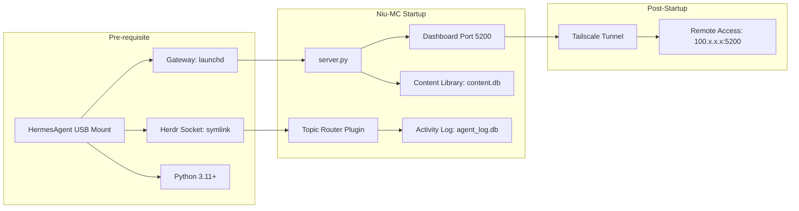

# Deployment & Maintenance: Niu-MissionControl Evolution

> **Status:** Aktif — Belum Deploy
> **URL:** `http://localhost:5200` (lokal) / `http://<tailscale-ip>:5200` (remote)
> **Diperbarui:** 17 Juli 2026

---

## 1. CI/CD Pipeline

Niu-MC tidak menggunakan CI/CD formal karena sifatnya single-developer project yang berjalan di Mac lokal.

| Tahap | Metode | Perintah |
|-------|--------|----------|
| **Build** | Tidak ada build step (Python interpreted) | - |
| **Test** | Smoke test manual | `bash scripts/smoke_test.sh` |
| **Deploy** | Git push + pull di Mac | `git add . && git commit -m "..." && git push` |

### Checklist Deploy Manual

```bash
# Sebelum deploy perubahan ke production:
# 1. Commit perubahan
git add -A
git commit -m "[Fase X] deskripsi"

# 2. Test di local dulu
python3 server.py &
curl http://localhost:5200/         # Harus 200
curl http://localhost:5200/api/mc/activity  # Harus JSON

# 3. Push
git push origin main

# 4. Restart server
kill $(lsof -t -i :5200)
python3 server.py &
```

---

## 2. Lingkungan

| Lingkungan | URL | Konfigurasi | Akses |
|------------|-----|-------------|-------|
| **Development** | `http://localhost:5200` | Debug mode | Lokal |
| **Production** | `http://<tailscale-ip>:5200` | Sama dengan dev (single env) | Lokal + Tailscale |

> **Catatan:** Project ini tidak memiliki staging environment karena single-machine. Semua perubahan di-test di development dulu sebelum dianggap production.

---

## 3. Strategi Rollback

### Jika ada bug di production:

```bash
# 1. Identifikasi perubahan terakhir yang menyebabkan masalah
git log --oneline -5

# 2. Rollback ke commit sebelumnya
git revert HEAD --no-edit

# 3. Restart server
kill $(lsof -t -i :5200)
git pull
python3 server.py &

# 4. Verifikasi
curl http://localhost:5200/   # Harus 200
```

| Metrik | Target |
|--------|--------|
| **RTO (Recovery Time Objective)** | < 5 menit |
| **RPO (Recovery Point Objective)** | < 1 commit (data di SQLite tidak ter-revert, hanya kode) |

> **Peringatan:** Rollback git TIDAK mengembalikan data di SQLite (agent_log.db, content.db). Data tetap aman. Jika ada perubahan schema, rollback membutuhkan migrasi manual.

---

## 4. Monitoring

| Apa | Bagaimana | Ambang Alert | Notifikasi Ke |
|-----|-----------|--------------|---------------|
| **server.py uptime** | Cron health check tiap 15 menit | Jika server mati > 1 menit | Telegram (#ops) |
| **Gateway status** | `/api/mc/gateway` | Jika offline > 30 detik | Telegram (orchestrator) |
| **Disk usage** | `scripts/health-check.py` | > 85% | Telegram (orchestrator) |
| **agent_log.db size** | Cron weekly check | > 100MB | Telegram (orchestrator) |
| **Cron job missed** | Cron state.db | Jika missed > 3 kali berturut | Telegram (orchestrator) |
| **Agent hang** | Dashboard Agents tab | Jika "working" > 10 menit | Dashboard (visual) |

### Health Check Script (Existing)

```bash
# scripts/health-check.py — sudah ada, bisa diperluas
python3 scripts/health-check.py
# Output: JSON dengan status semua komponen
```

---

## 5. Strategi Backup

| Data | Frekuensi | Retensi | Test Restore |
|------|-----------|---------|--------------|
| **Kode (git)** | Setiap commit | Selamanya (GitHub) | N/A — git clone |
| **Konfigurasi Hermes** | Manual (`~/.hermes/`) | Git backup | Belum diuji |
| **kanban.db** | Otomatis (state.db) | 7 hari | Belum diuji |
| **agent_log.db** | Tidak di-backup | Data non-kritis | Bisa di-rebuild |
| **Dokumen DOX** | Setiap update (git) | Selamanya (GitHub) | N/A — git |

### Command Backup Manual

```bash
# Backup agent_log.db (jika perlu)
cp data/agent_log.db data/backup/agent_log-$(date +%Y%m%d).db

# Backup semua konfigurasi
tar -czf ~/Desktop/niu-mc-backup-$(date +%Y%m%d).tar.gz \
  /Users/zaryu/Desktop/Niumination/projects/niu-mission-control/ \
  /Users/zaryu/.hermes/config.yaml
```

---

## 6. Runbook

### Operasi: Start Server

```bash
cd /Users/zaryu/Desktop/Niumination/projects/niu-mission-control
python3 server.py &
```

**Verifikasi:** `curl http://localhost:5200/` → 200 OK

### Operasi: Restart Server

```bash
kill $(lsof -t -i :5200)
sleep 1
cd /Users/zaryu/Desktop/Niumination/projects/niu-mission-control
python3 server.py &
```

**Verifikasi:** `curl http://localhost:5200/` → 200 OK

### Operasi: Cek Agent Log

```bash
# Cek jumlah total log
python3 -c "from modules.agent_log import *; init(); print(get_stats())"

# Cek 5 aktivitas terbaru
python3 -c "
from modules.agent_log import *
init()
for r in get_recent(5):
    print(f\"{r['created_at']} | {r['agent']:10} | {r['task'][:40]:40} | {r['status']}\")
"

# Hapus log > 30 hari (maintenance)
python3 -c "from modules.agent_log import *; init(); print(f'Deleted: {cleanup_old(30)} rows')"
```

### Operasi: Setup Topic Router (Pertama Kali)

```bash
# 1. Setup topic di Telegram:
#    - Buka group Niu-MissionControl
#    - Settings → Topics → ON
#    - Buat 6 topic: #dev, #audit, #plan, #ops, #docs, #social

# 2. Dapatkan Topic ID:
#    - Kirim /id ke @userinfobot di TIAP topic
#    - Catat message_thread_id

# 3. Update config.yaml di plugins/telegram_router/
#    - Masukkan Topic ID yang benar

# 4. Restart Hermes Agent
launchctl kickstart -kp gui/$(id -u)/ai.hermes.gateway
```

### Operasi: Setup Tailscale

```bash
# Install
brew install --cask tailscale

# Login
tailscale up
# Buka browser → login Google/GitHub

# Cek IP
tailscale ip -4
# Contoh: 100.x.x.x

# Update dashboard listener (server.py)
# Sudah listen di 0.0.0.0 secara default

# Akses dari mana saja:
# http://100.x.x.x:5200
```

### Operasi: Membersihkan Log Lama

```bash
# Otomatis (via cron — bisa ditambahkan)
# python3 -c "from modules.agent_log import *; init(); cleanup_old(30)"

# Manual jika DB terlalu besar
sqlite3 data/agent_log.db "DELETE FROM agent_log WHERE created_at < datetime('now', '-30 days'); VACUUM;"
```

### Operasi: Jika agent_log.db Corrupt

```bash
# Hapus DB, akan auto-create ulang
rm data/agent_log.db
python3 -c "from modules.agent_log import *; init(); print('✅ DB baru siap')"
# Note: Data lama hilang. Ini hanya untuk kasus corrupt.
```

---

## 7. On-Call

| Jadwal | Kontak | Eskalasi |
|--------|--------|----------|
| **Primer** | Afrizal Munthe (Telegram) | - |
| **Sekunder** | Hermes Agent (auto-recovery) | Jika gateway/agent down, launchd auto-restart |

> **Eskalasi:** Untuk kegagalan kritis yang tidak bisa di-recover otomatis, hubungi Afrizal via Telegram langsung.

---

## Lampiran A: Dependency Graph Startup



---

*Dokumen ini mengikuti template project-foundation skill.*
