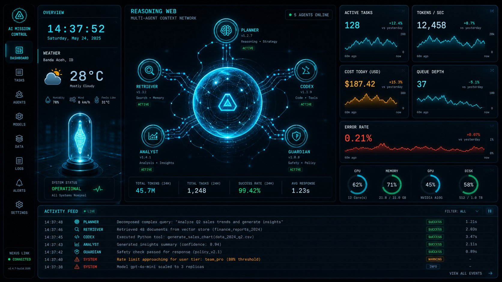
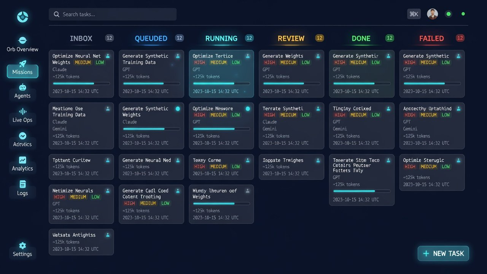
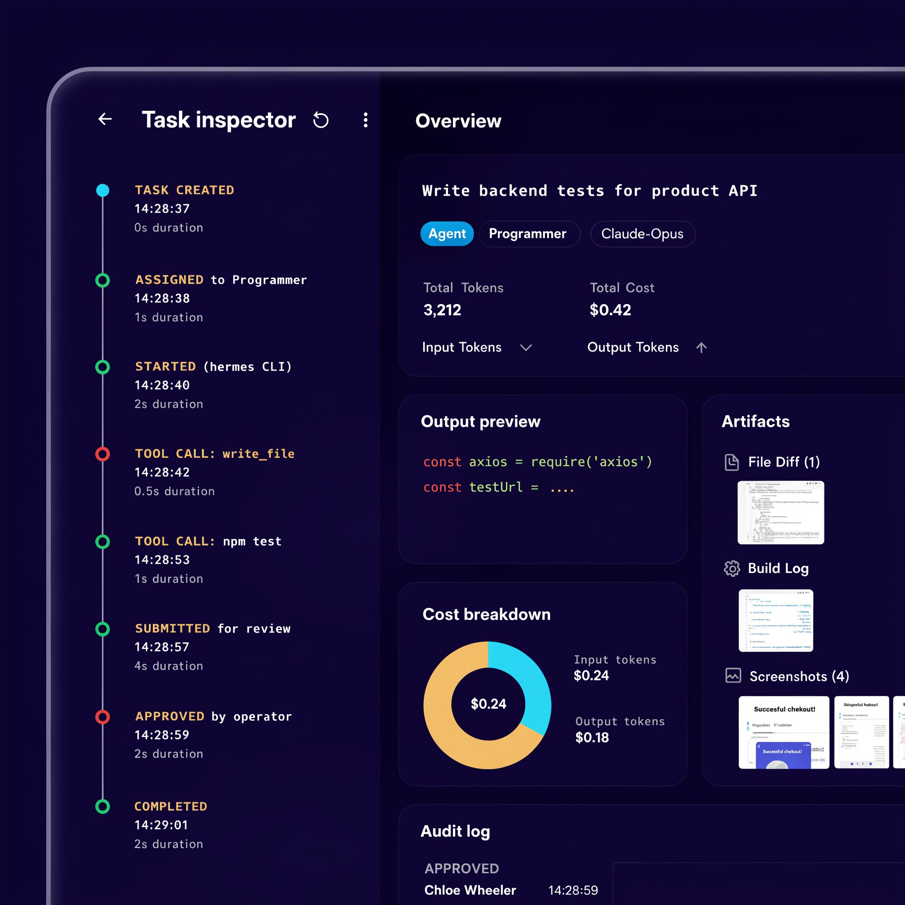
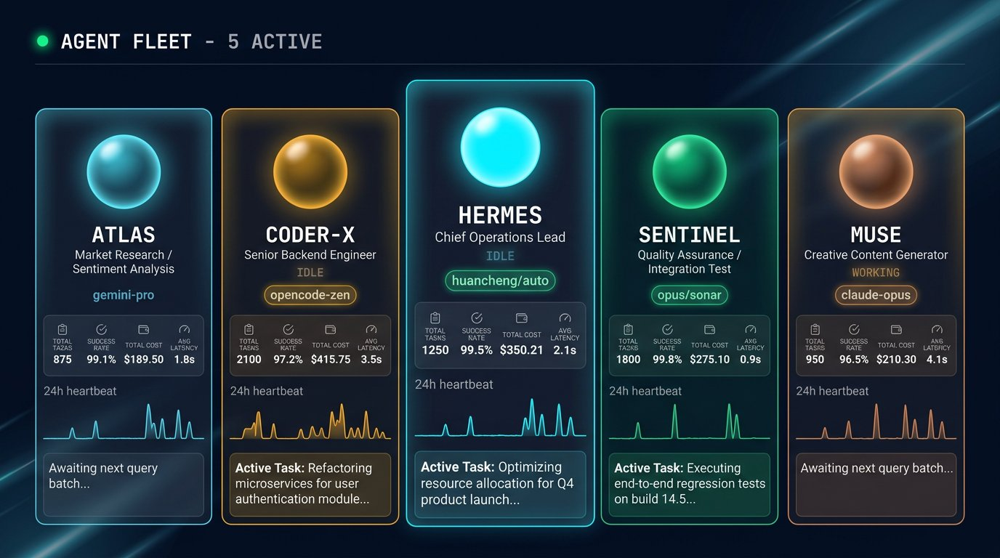
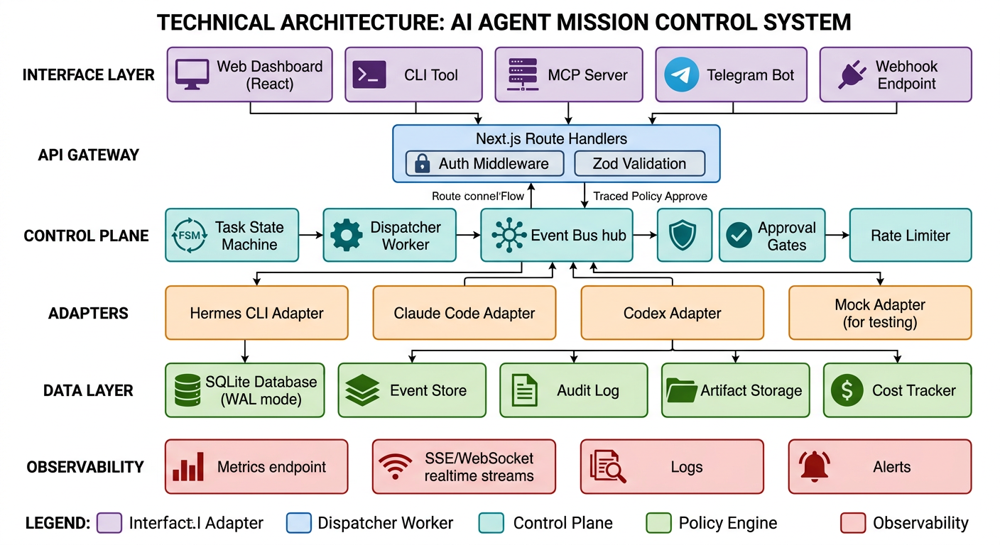

# PRD — Niumination Mission Control v4.0
## "The Hermes Swarm Control Plane"

| Field | Value |
|---|---|
| **Dokumen** | Product Requirements Document (PRD) |
| **Versi Produk Target** | v4.0.0 ("Aether") |
| **Versi Saat Ini (baseline)** | v3.0.0 (post-rapikan-audit, UI-only Next.js) |
| **Penulis** | Hermes Chief & Afrizal Munthe |
| **Tanggal** | 24 September 2026 |
| **Status** | ✅ Final — Benang merah pembangunan dari awal sampai selesai |
| **Target Delivery (solo dev, part-time)** | ~8–12 minggu bertahap per milestone |
| **Sumber inspirasi** | Builderz/mission-control, LangGraph, AgentCenter, Linear.app, Iron Man JARVIS, Apollo mission control |

---

## 📑 Daftar Isi

1. [Executive Summary](#1-executive-summary)
2. [Visi Produk & North Star Metric](#2-visi-produk--north-star-metric)
3. [Positioning & Audience](#3-positioning--audience)
4. [Success Metrics (OKR)](#4-success-metrics-okr)
5. [Information Architecture](#5-information-architecture)
6. [Konsep Visual (Design System)](#6-konsep-visual-design-system)
7. [Referensi Visual Halaman per Halaman](#7-referensi-visual-halaman-per-halaman)
8. [User Personas & Core Flows](#8-user-personas--core-flows)
9. [Functional Requirements (F1–F9)](#9-functional-requirements)
10. [Non-Functional Requirements (N1–N8)](#10-non-functional-requirements)
11. [Technical Architecture](#11-technical-architecture)
12. [Data Model & Schema](#12-data-model--schema)
13. [API Specification](#13-api-specification)
14. [Realtime Protocol](#14-realtime-protocol)
15. [Security Model](#15-security-model)
16. [Roadmap Milestone (M1–M11)](#16-roadmap-milestone-m1m11)
17. [Acceptance Criteria per Milestone](#17-acceptance-criteria-per-milestone)
18. [Risiko & Mitigasi](#18-risiko--mitigasi)
19. [Out of Scope (bukan di v4.0)](#19-out-of-scope-bukan-di-v40)
20. [Open Questions](#20-open-questions)
21. [Appendix: Referensi & Bacaan](#21-appendix-referensi--bacaan)

---

## 1. Executive Summary

Niumination Mission Control (NMC) saat ini (v3.0.0) adalah **sebuah UI showcase yang indah** — orb 3D dan reasoning web yang memiliki "jiwa" kuat, namun belum memiliki backend, orchestration, realtime, observability, maupun keamanan yang layak.

**v4.0 "Aether"** akan mentransformasi NMC dari sekadar "cockpit mockup" menjadi **sebuah self-hosted AI Agent Control Plane yang sesungguhan** — satu dasbor di mana operator (Afrizal) dapat:
1. **Melihat** seluruh 5 agent swarm (Chief, Research, Programmer, QA, Kreator) dan apa yang sedang mereka kerjakan secara *real-time*.
2. **Mengirimkan** tugas (dispatch) ke agent tertentu atau ke swarm, dan melihatnya dieksekusi end-to-end.
3. **Mengawasi** biaya token, keberhasilan, error, dan performa per agent.
4. **Menyetujui atau menolak** aksi berbahaya sebelum dieksekusi (approval gate).
5. **Menelusuri** hasil kerja setiap agent, artifact yang dihasilkan, dan jejak audit keputusan.

**Jiwa visual yang sudah ada (orb, reasoning web, estetika cyberpunk-elegant) TIDAK akan dibuang** — sebaliknya, lapisan visual itu akan **dihidupkan** dengan data nyata: orb berdenyut sesuai beban swarm, node reasoning web menyala sesuai agent yang aktif, particle mengalir mengikuti jalur komunikasi antar-agent.

**Filosofi desain:** *"The magic is in the machine."** — Visual yang mengagumkan harus mencerminkan sistem yang benar-benar bekerja di belakangnya.

---

## 2. Visi Produk & North Star Metric

### Visi
> **"Menjadi JARVIS pribadi yang dapat dipercaya — sebuah control plane di mana saya dapat melihat, mengendalikan, dan mempertanggungjawabkan seluruh swarm agent saya, dengan pengalaman visual yang tidak ada duanya."**

### Misi v4.0
Menghasilkan sebuah control plane **production-ready** untuk single-operator (Afrizal) yang:
- Stabil berjalan 24/7 di macOS LaunchAgent atau Linux systemd
- Dapat berkomunikasi dengan Hermes CLI sebagai agent runtime utama
- Memiliki observability penuh (token cost, error rate, task trace)
- Memiliki keamanan yang memadai (auth, approval gates, audit trail)
- Memiliki UI yang fungsional namun tetap mempertahankan identitas visual "Niumination Aether"
- Dapat menjadi dasar penambahan agent/runtime baru (Claude Code, Codex, dll.) tanpa rewrite

### North Star Metric (NSM)
> **Persentase tugas yang dikirim dari Telegram/Web UI yang selesai tanpa intervensi manual AND dapat dilihat jejak lengkapnya di dashboard.**
>
> Target v4.0: **≥ 80%** tugas rutin selesai otomatis; 100% tugas memiliki jejak audit lengkap.

### Metrik Pendukung (Leading Indicators)
- Dashboard uptime: ≥ 99% (setelah stabil)
- P95 latency API: < 200ms (non-streaming)
- Task success rate swarm: ≥ 75%
- Waktu operator untuk menyetujui aksi: < 30 detik (dari alert muncul)
- Token cost tracking accuracy: ≥ 95% dibanding billing provider

---

## 3. Positioning & Audience

### Positioning Statement
For **Afrizal Munthe (solo founder/developer Niumination)** who **needs to orchestrate a swarm of 5 AI agents across research, coding, QA, and content creation**, **Niumination Mission Control** is a **self-hosted AI agent control plane** that **unifies task dispatch, realtime monitoring, approval gates, cost tracking, and audit trails into a single visually distinctive dashboard**. Unlike **Builderz/mission-control or AgentCenter** (general-purpose, third-party), NMC is **purpose-built around the Hermes Chief swarm with a signature 3D orb interface that doubles as a live health indicator**.

### Primary Audience (v4.0)
| Role | Deskripsi | Kebutuhan |
|---|---|---|
| **Afrizal (Operator Utama)** | Solo dev, pengguna satu-satunya di v4.0 | Lihat status swarm, dispatch tugas, approve/block aksi, lacak biaya, trace error dengan cepat |

### Audience Sekunder (v5.0+)
- Anggota tim Niumination di masa depan (butuh RBAC viewer/operator/admin)
- Pengguna lain yang meng-fork repo (self-hosted, small swarm 2–20 agent)

### Bukan Audience (untuk saat ini)
- Enterprise dengan 100+ agent (butuh Redis/Postgres/K8s)
- Multi-tenant SaaS
- Pengguna non-teknis

### Analisis Kompetitor & Diferensiasi

| Produk | Strength | Kelemahan | Keunggulan NMC |
|---|---|---|---|
| **Builderz/mission-control** | Mature, 6k+ stars, SQLite + Next.js, 6 runtime adapters | Generic UI, tidak ada identitas visual, tidak ada orb/reasoning | **Visual signature** (orb + reasoning web) yang hidup; native Hermes adapter; estetika premium |
| **AgentCenter** | SaaS, Kanban + activity stream, 50 agent | Perlu langganan, data lewat server ketiga, framework-agnostic tapi closed | **Local-first**, data tidak keluar dari mesin kita; bisa dikustom total |
| **LangSmith** | Observability LLM kelas atas, tracing detail | Hanya observability, bukan control plane; berbayar; LangChain-only | **Control plane lengkap** (bukan cuma observ); runtime-agnostic via adapter |
| **CrewAI Platform** | Built-in orchestration, role-based | CrewAI-only, opinif, mahal di enterprise tier | **Framework-agnostic**; Hermes-first; visual yang lebih "alive" |
| **v3.0 sekarang** | Visual cantik | Tidak ada orchestration/realtime/security | — (baseline yang ditingkatkan) |

---

## 4. Success Metrics (OKR)

### Objective 1: Control Plane Berfungsi Penuh
- **KR1.1:** Semua endpoint REST API (14 endpoint) lulus integration test dengan coverage ≥ 80%
- **KR1.2:** Worker loop berhasil meng-claim task dari queue, mengeksekusi via HermesAdapter, dan meng-update status dengan success rate ≥ 95% (happy path)
- **KR1.3:** Retry + dead letter queue bekerja (task yang gagal retry 3x masuk DLQ dengan error tercatat)
- **KR1.4:** Tidak ada `execSync` pemanggilan Python di codebase; seluruh operasi DB via `better-sqlite3` native

### Objective 2: Realtime & Hidup
- **KR2.1:** SSE endpoint mengirim event dalam < 100ms dari state change
- **KR2.2:** Client reconnect otomatis dengan replay event yang terlewat (Last-Event-ID)
- **KR2.3:** Orb dan ReasoningWeb merespons event stream (node menyala saat agent bekerja, orb pulse sesuai beban)
- **KR2.4:** Activity feed di UI update sendiri tanpa refresh

### Objective 3: Aman dan Diaudit
- **KR3.1:** Semua endpoint `/api/mc/*` di belakang auth middleware (API key atau session cookie)
- **KR3.2:** Semua input divalidasi dengan Zod (100% POST/PATCH body)
- **KR3.3:** Approval gate aktif untuk shell command, external send, dan delete; 100% keputusan tercatat di audit log (immutable)
- **KR3.4:** Tidak ada secret (chat ID, API key) yang di-hardcode di source; semua dari env; startup fail-fast jika env wajib kosong

### Objective 4: Operator Workflow Cepat
- **KR4.1:** Operator bisa dispatch tugas ke agent dalam ≤ 2 klik (atau 1 ⌘K command)
- **KR4.2:** Operator bisa melihat health swarm (agent count, queue depth, error rate, cost hari ini) **tanpa klik apapun** di halaman utama
- **KR4.3:** Task inspector bisa dibuka dari manapun dan menampilkan trace lengkap dalam < 500ms
- **KR4.4:** Tidak ada polling manual; semua update via SSE (kecuali fallback saat SSE gagal)

### Objective 5: Operasi Stabil
- **KR5.1:** LaunchAgent/systemd bertahan dari kill -9 (auto-restart)
- **KR5.2:** Health endpoint berguna (DB ok, uptime, memory, queue depth, connected agent count)
- **KR5.3:** Backup otomatis harian SQLite dengan retention 30 hari
- **KR5.4:** Docker image berhasil dibuild dan `docker compose up` jalan di mesin baru tanpa konfigurasi manual selain env

---

## 5. Information Architecture

### Struktur Navigasi (Sidebar Kiri)

```
Niumination Mission Control v4.0
┌──────────────────────────────────────────────────────────────────────┐
│ [🔮] OVERVIEW  (L0)         ← Halaman utama: Orb + stats + feed     │
│ [📋] MISSIONS  (L1)         ← Kanban board + task lifecycle         │
│ [👥] AGENTS    (L1.5)       ← Fleet roster + agent detail           │
│ [⚡] LIVE OPS  (L2)         ← Streaming logs + terminal + dispatch  │
│ [🔍] INSPECTOR ← terbangun saat klik task id dari manapun           │
│ [📊] ANALYTICS (L3)         ← Cost, metrics, charts                 │
│ [📜] AUDIT LOG              ← Immutable audit trail                 │
│ [⚙️] SETTINGS               ← Config, API keys, agent setup, budget │
└──────────────────────────────────────────────────────────────────────┘
                                                                        
  [?] Help & Shortcuts    [⌘K] Command Palette (global)                
```

### Peta Halaman (Routes)

| Route | Halaman | Akses |
|---|---|---|
| `/` | L0 Fleet Overview (orb + stats + activity) | viewer+ |
| `/missions` | L1 Mission Kanban (semua kolom) | viewer+ |
| `/missions/[taskId]` | L3 Task Inspector (trace + artifact + cost) | viewer+ |
| `/agents` | Agent roster grid | viewer+ |
| `/agents/[agentId]` | Agent detail (history, config, current session) | operator+ |
| `/ops` | Live Ops (logs, terminal, dispatch composer, approvals) | operator+ |
| `/analytics` | Charts & metrics | viewer+ |
| `/audit` | Audit log table | admin |
| `/settings` | Configuration | admin |
| `/api/mc/*` | REST endpoints | via auth |
| `/api/mc/events` | SSE stream | via auth |
| `/api/mc/ws` | WebSocket control channel | via auth |

### App Shell
Setiap halaman (kecuali inspector modal) berbagi shell yang sama:
- **Sidebar kiri** (collapsible) dengan nav icon
- **Topbar** dengan: breadcrumb, global search, ⌘K trigger, notifikasi bell (approval + alert), status indicator dot, clock+weather
- **Main content area** di mana halaman dirender
- **Orb mini version** di sidebar (2cm diameter, pulse sesuai health) atau versi besar di Overview

---

## 6. Konsep Visual (Design System)

### 6.1 Design Principles

1. **"Alive glass"** — Panel glassmorphism tidak mati; glow dan pulsasi lembut mencerminkan data (bukan dekorasi acak)
2. **Functional density, bukan emptiness** — Setiap elemen di layar harus punya alasan. Jangan biarkan 80% layar kosong cuma demi estetika.
3. **Hierarki informasi yang ketat** — Warna neon hanya untuk hal yang butuh perhatian (status, alert, active state). Background dan text netral.
4. **Monospace untuk data, sans-serif untuk narasi** — JetBrains Mono untuk angka/kode/label teknis; system sans untuk deskripsi.
5. **Dark-first, bukan black** — Tidak pernah `#000000` murni. Gunakan slate navy dalam untuk mengurangi eye strain.
6. **Orb is the heartbeat** — Orb di halaman utama adalah "wajah" sistem. Semua kejadian penting tercermin di orb sebelum dilihat di panel.
7. **Motion ada maknanya** — Setiap animasi/transisi berhubungan dengan data atau interaksi. Hindari animasi "hanya karena keren."

### 6.2 Design Tokens

File: `apex-ui/app/design-tokens.css` (root CSS variables)

```css
:root {
  /* ── Backgrounds (dark mode slate, bukan hitam) ── */
  --bg-base:        #0a0f1a;   /* canvas paling dasar */
  --bg-surface:     rgba(15, 23, 42, 0.72);   /* glass panel */
  --bg-surface-2:   rgba(22, 32, 52, 0.85);   /* panel elevated */
  --bg-elevated:    rgba(30, 41, 59, 0.9);    /* modal/hover */
  --bg-input:       rgba(8, 14, 26, 0.6);

  /* ── Text ── */
  --text-primary:   #e8eef5;   /* judul, label aktif */
  --text-secondary: #94a3b8;   /* deskripsi, metadata */
  --text-muted:     #546a7d;   /* label tersier, disabled */
  --text-mono:      var(--font-mono);

  /* ── Accent Palette (Niumination Brand) ── */
  --cyan:           #00e5ff;   /* primary, active, thinking state */
  --cyan-dim:       #0891b2;
  --amber:          #f5a623;   /* warning, review, Programmer accent */
  --emerald:        #34d399;   /* success, online, QA accent */
  --red:            #ef4444;   /* error, critical, failed */
  --violet:         #8b5cf6;   /* shell/terminal */
  --gold:           #ffcf6b;   /* core orb, speaking state */

  /* ── Spacing (4px grid) ── */
  --sp-1: 4px; --sp-2: 8px; --sp-3: 12px; --sp-4: 16px;
  --sp-5: 20px; --sp-6: 24px; --sp-8: 32px; --sp-10: 40px;

  /* ── Radius ── */
  --r-sm: 6px; --r-md: 10px; --r-lg: 14px; --r-xl: 20px; --r-pill: 999px;

  /* ── Shadows & Glow ── */
  --shadow-sm: 0 2px 8px rgba(0,0,0,0.3);
  --shadow-md: 0 8px 24px rgba(0,0,0,0.4);
  --shadow-lg: 0 20px 60px rgba(0,0,0,0.5);
  --glow-cyan: 0 0 12px var(--cyan), 0 0 32px rgba(0,229,255,0.3);
  --glow-amber: 0 0 12px var(--amber), 0 0 32px rgba(245,166,35,0.3);
  --glow-red: 0 0 12px var(--red), 0 0 32px rgba(239,68,68,0.3);

  /* ── Typography ── */
  --font-sans: ui-sans-serif, -apple-system, "Segoe UI", Roboto, sans-serif;
  --font-mono: ui-monospace, "SF Mono", Menlo, "JetBrains Mono", "Fira Code", monospace;

  /* ── Transitions ── */
  --t-fast: 120ms ease;
  --t-base: 220ms cubic-bezier(0.16, 1, 0.3, 1);
  --t-slow: 400ms cubic-bezier(0.16, 1, 0.3, 1);
}
```

### 6.3 Tipografi Scale
| Token | Size | Weight | Use case |
|---|---|---|---|
| `text-display` | 56px / 64px | 300 | Time di overview |
| `text-h1` | 28px | 600 | Page title |
| `text-h2` | 18px | 600 | Card title, section |
| `text-body` | 13.5px | 400 | Body |
| `text-sm` | 11.5px | 400 | Metadata, descriptions |
| `text-label` | 9.5px | 600 + uppercase + tracking 0.12em | Labels, badges, section headers |
| `text-metric` | 32px | 700 (tabular-nums) | Big number stats |

### 6.4 Color Semantics (bukan cuma "cyan/amber" tapi makna)
| Warna | Makna | Contoh |
|---|---|---|
| 🟢 `--emerald` | Sehat/Sukses/Online | Status online, task completed, DB connected |
| 🔵 `--cyan` | Aktif/Berpikir/Info | Agent bekerja, thinking state, info, active nav |
| 🟡 `--amber` | Perhatian/Review/Pending | Awaiting approval, review gate, warning |
| 🔴 `--red` | Kritis/Gagal/Error | Failed task, offline agent, alert banner |
| 🟣 `--violet` | Terminal/Shell | Shell execution, debug, developer tooling |
| ✨ `--gold` | Core/speaking | Orb center saat agent menghasilkan output |

### 6.5 Component Library (Minimal Viable)
Dibangun sebagai reusable component, bukan inline styles:
- `<Button>` variant (primary, ghost, danger, icon)
- `<Card>` (panel glass dengan judul)
- `<StatusDot>` (denyut sesuai status)
- `<Badge>` (priority, status, agent type)
- `<Input>`, `<Select>`, `<Textarea>` dengan focus glow
- `<Modal>` / `<Sheet>` (slide-in panel, backdrop blur)
- `<Tabs>`
- `<StatCard>` (angka besar + sparkline)
- `<ActivityItem>` (event row di feed)
- `<TaskCard>` (untuk kanban)
- `<TraceStep>` (timeline dot di inspector)
- `<Toast>` (notification, 3 tipe: success, warning, error)
- `<Skeleton>` (loading placeholder)
- `<CommandPalette>` (⌘K)

**Catatan implementasi:** Gunakan CSS Modules atau pindah ke **Tailwind CSS 4** (Rekomendasi: **Tailwind 4** seperti yang dipakai Builderz/mission-control) untuk konsistensi dan kecepatan pengembangan.

### 6.6 Motion & Micro-interaction
- Panel slide-in: 350ms cubic-bezier(0.16,1,0.3,1)
- Button hover: background shift 150ms
- Status dot: pulse 2s ease-in-out infinite
- Orb state transisi: 600ms ease
- Particle flow di reasoning web: kecepatan proporsional dengan aktivitas agent
- Approval banner: slight shake (2x sekali) saat masuk agar menarik perhatian
- Task card saat di-drag: scale 1.02 + shadow lift
- Semua animasi menghormati `prefers-reduced-motion`

---

## 7. Referensi Visual Halaman per Halaman

Berikut konsep visual untuk halaman-halaman utama. Gambar referensi disimpan di `docs/assets/`.

### 7.1 L0 — Fleet Overview (Halaman Utama)



**Layout (16:9):**
- **Center (60% layar):** Orb 3D ukuran besar (~500px) + ReasoningWeb yang terhubung ke event stream
- **Top-left:** ApexOverviewPanel (filament + clock + weather + weather) — dipertahankan dari v3
- **Top-right: Stat grid 2x3** (glass cards):
  - Active Tasks (with sparkline 24h)
  - Tokens/sec (realtime)
  - Cost Today ($)
  - Queue Depth
  - Error Rate (%)
  - Uptime
- **Left sidebar** dengan nav icon dan mini-orb indicator
- **Bottom: Activity Feed strip** (horizontal ticker atau panel vertikal kanan-bawah) menampilkan 20 event terbaru
- **Approval banner** (jika ada aksi yang menunggu keputusan) — melebar di atas orb, amber pulse

**Orb behavior:**
- **Idle:** Orb tenang, particle lambat, warna cyan redup
- **Thinking (agent bekerja):** Particle orbit lebih cepat, interior boil intens, cyan brightness 1.5x
- **Speaking (agent menghasilkan output):** Gold core menyala terang, ripple wave keluar
- **Alert/Error:** Denyut merah lembut di perimeter
- **High load (>3 agent aktif):** Ukuran sedikit membesar (1.05x), pulse lebih cepat
- **Offline:** Orb redup ke abu-abu, tidak ada particle bergerak

**ReasoningWeb behavior:**
- Node agent yang sedang bekerja: scaled 1.1x, full glow warna agent, label menyala
- Spoke jalur komunikasi: particle cyan mengalir dari Chief ke agent dan sebaliknya
- Node idle: opacity 0.4, tidak bercahaya
- Semua berbasis event stream, bukan timer acak.

### 7.2 L1 — Mission Kanban



**Layout:**
- **Full-width 6 columns** dengan header sticky saat scroll
- Setiap column:
  - Header dengan nama kolom + count badge + warna
  - Container glass dengan scroll vertikal untuk cards
  - Drop zone untuk drag-and-drop

**Kolom state machine (kiri ke kanan):**
1. **📥 INBOX** (abu-abu) — tugas yang baru masuk (dari Telegram/webhook/manual), belum di-assign
2. **⏳ QUEUED** (biru redup) — sudah di-assign, menunggu giliran dieksekusi
3. **🔄 RUNNING** (cyan berdenyut) — sedang dieksekusi oleh agent; card ada mini progress bar + ETA
4. **👀 REVIEW** (amber) — selesai dieksekusi, menunggu approval operator (jika aksi berbahaya) atau QA verification
5. **✅ DONE** (emerald redup) — selesai, hasil terverifikasi
6. **❌ FAILED** (merah) — gagal setelah max retry; card menampilkan error message singkat, tombol Retry + View Error

**Task Card:**
- Priority strip di kiri (merah/kuning/hijau untuk high/medium/low)
- Title task (2 baris max, truncated)
- Agent dot (warna) + nama agent + model
- Badge status
- Progress bar (jika running)
- Footer: timestamp (relativ: "2m ago"), token cost estimate, artifact count
- Hover: action buttons muncul (View, Pause, Cancel, Approve)

**Toolbar di atas kanban:**
- Search
- Filter (by agent, priority, status, date range)
- Sort (newest, oldest, priority, cost)
- View toggle (compact/comfortable)
- "+ New Task" floating FAB di kanan-bawah

### 7.3 L3 — Task Inspector (Modal/Overlay atau halaman penuh)



**Dibuka dengan:** Klik task card di kanban, klik event di activity feed, Cmd+K search task id, klik node agent yang sedang bekerja.

**Layout:**
- **Panel kanan (40% lebar) atau halaman penuh split 50/50**
- **Kiri: Timeline trace vertikal** — setiap event di task lifecycle dengan dot berwarna, connector line, timestamp dan durasi
- **Kanan atas:** Header dengan title, agent info, status badge besar, tombol aksi (Approve, Reject, Retry, Cancel, Re-run)
- **Kanan tengah:** Tab panel (Output / Artifacts / Cost / Raw Logs)
  - **Output:** Final output agent (markdown rendered)
  - **Artifacts:** List file yang dihasilkan (dengan diff viewer untuk kode, preview untuk gambar, link download)
  - **Cost:** Breakdown per model (input tokens, output tokens, cost USD), pie chart, dibanding rata-rata
  - **Raw Logs:** Full transcript hermes/agent CLI output (virtualized scroll)
- **Kanan bawah:** Approval history (siapa menyetujui kapan, komentar jika ada)

### 7.4 Agents Page



**Layout:** Grid card 5 agent, dengan kartu Chief paling besar dan ditengah.

**Setiap kartu:**
- Avatar orb mini dengan warna agent
- Nama + Role
- Status dot (online/idle/working/offline)
- Model yang sedang digunakan
- Stats: total tasks, success rate (%), total cost ($), avg latency (s)
- Mini sparkline aktivitas 24 jam terakhir
- Current task (jika working, dengan progress bar kecil)
- Click → buka `/agents/[id]` dengan history task agent, konfigurasi, session aktif

### 7.5 Live Ops Page
Belum ada gambar referensi karena sifatnya internal/teknis. Layout:
- **Kiri (50%):** Streaming logs panel (virtualized), dengan filter by agent/level/search, warna per level (info=cyan, warn=amber, error=red)
- **Kanan atas (25%):** Terminal read-only (xterm.js) — tail dari agent yang sedang aktif bekerja
- **Kanan tengah (25%):** Dispatch composer (form: agent select, instruction text, priority, model override, toggle "approval required")
- **Bawah kanan:** Approval queue — list aksi yang menunggu keputusan, dengan Approve/Reject cepat per item

### 7.6 Analytics Page
- Top: 4 StatCard besar (Total Tasks 7h/24h/7d, Success Rate %, Total Cost $, Avg Task Duration)
- Charts:
  - Tasks per day (bar chart 30 hari)
  - Cost per agent (stacked bar)
  - Success rate per agent (horizontal bar)
  - Token usage per model (pie)
  - Task duration distribution (histogram)
  - Queue depth over time (line)

### 7.7 Settings Page
Dikelompokkan dalam tab:
- **General:** Nama instance, timezone, lokasi (untuk weather), theme (dark/classic/experimental)
- **Agents:** Tambah/edit/remove agent, set system prompt, set model default, warna, role
- **Adapters:** Konfigurasi path Hermes CLI, koneksi runtime tambahan
- **Notifications:** Telegram chat ID, alert rules (error threshold, cost budget)
- **Security:** API key management (buat/revoke), session timeout, enable/disable approval gates per action type
- **Budget:** Daily/monthly budget hard limit (kill switch jika terlampaui)
- **Backup:** Manual backup, lokasi, jadwal auto-backup
- **About:** Versi, credits, link ke github, debug info

### 7.8 Audit Log Page
- Tabel besar, filterable, immutable (tidak bisa diedit/dihapus dari UI)
- Kolom: Timestamp, Actor (operator/system/agent), Action, Target (task/dispatch), Result, IP/Client
- Search + export CSV

---

## 8. User Personas & Core Flows

### Persona Utama: Afrizal (Operator)

**Profil:** Solo developer, bekerja dari Banda Aceh, menggunakan Hermes + swarm untuk meneliti, ngoding, testing, dan membuat konten Niumination. Sudah familiar dengan terminal, CLI, dan GitHub. Menggunakan MC setiap hari untuk memantau kerja agent dan melemparkan tugas baru.

**Pain points di v3.0:**
- Tidak tahu task sudah selesai atau belum tanpa refresh manual
- Tidak tahu biaya token terakumulasi berapa
- Pernah tidak sengaja expose endpoint karena tidak ada auth
- Tidak bisa lihat error tanpa buka terminal
- Ribet untuk melihat hasil kerja agent per satu

### Core User Flows (CUF)

#### CUF-1: Operator Melempar Tugas Baru ke Agent
```
1. Operator membuka MC → halaman Overview (default)
2. Operator menekan Cmd+K → command palette terbuka
3. Operator ketik "tugas: buatkan audit PRD untuk mission control" + Enter
4. Palette menanyakan: assign ke siapa? → default "chief" (Chief memecah sendiri)
5. Priority? → default "medium"
6. Task dibuat → masuk INBOX
7. Chief claim dalam <5s → task pindah ke RUNNING, ReasoningWeb node Chief menyala
8. Operator melihat orb masuk mode "thinking"
9. Operator bisa kembali bekerja; saat butuh bisa buka task inspector dari activity feed
10. Jika agent perlu approval, banner kuning muncul, notifikasi Telegram dikirim
11. Operator klik Approve → agent lanjut
12. Task selesai → pindah ke DONE, orb kembali idle sebentar, activity feed menampilkan completion event
13. Hasil bisa dilihat di inspector (output + artifact + cost)
```

#### CUF-2: Operator Memantau Kesehatan Swarm
```
1. Operator buka MC di pagi hari
2. Halaman Overview langsung menampilkan:
   - Orb hijau/cyan (aman) vs merah (ada error)
   - Stat cards: Cost kemarin $X, queue depth Y, error rate Z%
   - Jika ada error, card merah + alert menyala
3. Operator bisa lihat alert, klik untuk ke task yang bermasalah
4. Operator klik retry atau ambil alih jika perlu
```

#### CUF-3: Operator Menyetujui Aksi Berbahaya
```
1. Agent Programmer mencoba menjalankan "npm deploy --production"
2. Karena aksi deploy masuk kategori berbahaya, task masuk REVIEW
3. MC menampilkan banner amber di Overview, mengirim notifikasi Telegram ke operator dengan preview aksi
4. Operator klik banner / buka inspector task
5. Inspector menampilkan: aksi apa, argumen lengkap, output sejauh ini, estimasi dampak
6. Operator klik Approve (atau Reject dengan alasan)
7. Keputusan tercatat di audit log
8. Jika approved, agent lanjut; jika rejected, task di-cancel dengan reason tercatat
```

#### CUF-4: Operator Melacak Biaya Token
```
1. Operator buka Analytics
2. Melihat biaya hari ini $X, bulan ini $Y, vs budget
3. Klik cost per agent chart → lihat Programmer paling banyak makan token
4. Klik Programmer bar → filter task oleh Programmer
5. Bisa melihat task mana yang paling mahal, memutuskan untuk turunkan model atau optimize prompt
```

#### CUF-5: Operator Menerima Tugas dari Telegram
```
1. Operator kirim pesan ke Telegram chat grup Niumination thread Programmer
2. Hermes CLI menerima pesan → adapter membuat task baru di INBOX
3. Event dikirim ke dashboard SSE
4. Dashboard update otomatis: activity feed bertambah, Programmer node menyala, queue depth bertambah
5. Siklus sama seperti CUF-1 dari langkah 6
```

---

## 9. Functional Requirements

Modul fungsional di-organisir berdasarkan domain (F1–F9).

### F1: Authentication & Session
- **F1.1** Sistem generate API key saat first-run (disimpan di `.env.local`)
- **F1.2** Middleware memeriksa API key di header `X-API-Key` untuk semua `/api/mc/*`
- **F1.3** Web UI menggunakan session cookie (httpOnly, sameSite=strict) setelah login via form sederhana (password dari env)
- **F1.4** (v4.0 cukup 1 user admin; RBAC bisa ditambah nanti)
- **F1.5** Logout endpoint menghapus session

### F2: Agent Registry
- **F2.1** CRUD agent (id, name, role, color, model default, system prompt, enabled)
- **F2.2** Agent heartbeats: adapter melaporkan "last_seen" setiap N detik; jika > 30s dianggap offline
- **F2.3** Endpoint `GET /api/mc/agents` return daftar agent dengan stats (total tasks, success rate, avg latency, current task)
- **F2.4** Seed 5 agent default (Hermes Chief, Research, Programmer, QA, Kreator) jika DB kosong

### F3: Task Lifecycle & State Machine
- **F3.1** State machine eksplisit: `inbox → queued → running → review → done | failed | cancelled`
- **F3.2** Transisi tervalidasi: tidak bisa `done` langsung dari `inbox`; tidak bisa `running` tanpa di-claim; dll.
- **F3.3** Task punya field: title, description, assigned_agent, priority, status, depends_on, idempotency_key, retry_count, max_retries, metadata (JSONB), deadline
- **F3.4** Create task (POST) dengan idempotency key (duplicate key return task yang sudah ada, bukan buat baru)
- **F3.5** Claim task oleh worker (atomic UPDATE ... WHERE status='queued' LIMIT 1)
- **F3.6** Update task status dengan validasi transisi
- **F3.7** Cancel task (operator action, hanya jika belum running)
- **F3.8** Retry task (naikkan retry_count, reset status ke queued)
- **F3.9** Task dependency: task yang punya `depends_on` tidak bisa di-claim sampai task predecessor selesai
- **F3.10** Priority ordering: high > medium > low; FIFO dalam priority yang sama

### F4: Dispatcher Worker Loop
- **F4.1** Worker berjalan di proses Next.js server (bukan client) dengan interval 3 detik
- **F4.2** Saat worker menemukan task queued (tidak ada dependency, tidak menunggu approval):
  - Claim task (status → running, set started_at)
  - Panggil adapter sesuai agent
  - Pantau status (poll atau callback)
  - Jika selesai: set status done/review, catat result, artifact, cost
  - Jika gagal: retry_count++, jika < max_retries → kembali queued dengan backoff; jika ≥ max_retries → failed
- **F4.3** Backoff eksponensial: delay = 2^retry_count detik (2s, 4s, 8s, max 60s)
- **F4.4** Dead letter: task yang gagal 3x tetap di DB dengan last_error, bisa di-retry manual
- **F4.5** Worker loop tidak boleh mati meskipun satu task error (try-catch per iteration)
- **F4.6** Emit event untuk setiap perubahan status

### F5: Agent Runtime Adapters
- **F5.1** Interface `AgentAdapter`: `send(task) → RunHandle`, `poll(runId) → RunState`, `collect(runId) → Result`, `cancel(runId) → void`
- **F5.2** `HermesCLIAdapter` (yang paling penting untuk v4.0):
  - Memanggil `hermes -z <prompt> --resume <session_id>` via execFile (tidak pernah dengan shell=true)
  - Parsing stdout untuk token usage (cost tracking)
  - Mem-parsing stderr untuk error detection
  - Configurable path via env
- **F5.3** `MockAdapter` (untuk development/testing): mensimulasikan kerja agent dengan delay random dan success/failure rate; berguna untuk dev tanpa harus menjalankan hermes
- **F5.4** Registry adapter sehingga menambah adapter baru semudah membuat file baru di `lib/server/adapters/`

### F6: Approval Gates
- **F6.1** Kategori aksi yang butuh approval (configurable):
  - `shell_exec` — mengeksekusi perintah shell di luar allowlist
  - `external_send` — mengirim pesan ke Telegram/eksternal
  - `deploy` — perintah deploy
  - `file_delete` — menghapus file
  - `db_mutation` — mengubah database/catatan
- **F6.2** Saat agent akan melakukan aksi di kategori itu, task masuk status `awaiting_approval` (sub-state running)
- **F6.3** Approval request berisi: agent, task, action type, preview argumen/isi, timestamp
- **F6.4** UI menampilkan banner + modal dengan detail, tombol Approve/Reject (dengan alasan untuk reject)
- **F6.5** Kirim notifikasi Telegram (atau channel yang dikonfig) saat ada approval yang menunggu
- **F6.6** Approval timeout (configurable, default 1 jam) → auto-reject dengan reason "timeout"
- **F6.7** Setiap keputusan (approve/reject/timeout) tercatat immutable di audit log

### F7: Realtime Event Stream
- **F7.1** Event sourcing: setiap state change append ke tabel `events`
- **F7.2** SSE endpoint `/api/mc/events` dengan:
  - Replay event yang terlewat via `Last-Event-ID` header
  - Auto reconnect client-side dengan exponential backoff
  - Event type filtering via query param (`?types=task.*,agent.*`)
- **F7.3** Event types (minimal):
  - `task.created`, `task.claimed`, `task.started`, `task.progress`, `task.completed`, `task.failed`, `task.cancelled`
  - `agent.heartbeat`, `agent.online`, `agent.offline`
  - `approval.requested`, `approval.approved`, `approval.rejected`
  - `alert.raised`, `alert.resolved`
  - `dispatch.sent`, `dispatch.acknowledged`
  - `system.cost_recorded`
- **F7.4** Client subscribe via EventSource; update Zustand stores saat event tiba (tidak perlu polling)
- **F7.5** Orb dan ReasoningWeb subscribe ke stream dan berubah state sesuai event
- **F7.6** Fallback: jika SSE gagal (misal jaringan block), client polling setiap 10s sebagai backup

### F8: Observability & Metrics
- **F8.1** Record cost setiap task selesai (input/output tokens, model, provider, cost_usd)
- **F8.2** Endpoint `/api/mc/metrics` (JSON) return:
  - Task throughput (per hour/day)
  - Success rate per agent dan overall
  - Cost today, this week, this month
  - Average task duration per agent
  - Queue depth (current)
  - Active agent count
  - p50/p95 latency
  - Token per minute rate
- **F8.3** Structured logs (JSON) dengan level, timestamp, correlation ID
- **F8.4** System log table (level, message, source, timestamp) untuk ditampilkan di UI
- **F8.5** Audit log table (immutable): actor, action, target, result, timestamp, client_ip
- **F8.6** Alert rules (configurable):
  - Agent error 3x berturut-turut → alert
  - Daily budget terlampaui → alert + possible auto-throttle
  - Queue depth > threshold (e.g. 20) dalam 5 menit → alert
  - Agent offline > 2 menit → alert
  - Alert dikirim ke UI banner + Telegram

### F9: Dispatch & Communication
- **F9.1** Endpoint POST `/api/mc/dispatch` dengan validasi target (topic), message, idempotency key
- **F9.2** Telegram send (terintegrasi dengan Hermes CLI atau Telegram Bot API langsung)
- **F9.3** Webhook endpoint `/api/mc/webhooks/telegram` (jika pakai Bot API mode) untuk menerima pesan masuk sebagai task baru
- **F9.4** Activity feed: gabungan event dari semua sumber untuk ditampilkan di Overview dan Logs

---

## 10. Non-Functional Requirements

### N1: Performa
- **N1.1** First Contentful Paint < 1.5s (localhost)
- **N1.2** API response time p95 < 200ms (operasi CRUD sederhana)
- **N1.3** SSE event delivery < 100ms dari state change
- **N1.4** Orb + ReasoningWeb render di 60fps di laptop modern; turun ke 30fps otomatis jika FPS drop (perf budget)
- **N1.5** Logs list virtualized sehingga bisa menampilkan 10.000 entri tanpa lag
- **N1.6** Bundle JS halaman utama < 200KB (terkompresi), tidak termasuk three.js (yang di lazy-load)

### N2: Keandalan
- **N2.1** Worker loop tidak crash meskipun 100% task gagal (isolasi error per task)
- **N2.2** SQLite WAL mode untuk concurrent read aman dengan single-writer
- **N2.3** Graceful shutdown: saat SIGTERM, worker menunggu task running selesai (dengan timeout 30s) sebelum exit, checkpoint state
- **N2.4** LaunchAgent/systemd auto-restart saat crash (KeepAlive/Restart=always)
- **N2.5** Database integrity: PRAGMA foreign_keys=ON, transaksi untuk setiap mutasi
- **N2.6** Backup harian otomatis ke file `backup-YYYYMMDD-HHMM.db` dengan retention 30 hari

### N3: Keamanan
- **N3.1** Auth selalu-on (tidak ada "dev mode tanpa auth")
- **N3.2** Semua input divalidasi dengan Zod schema; input yang invalid return 400, tidak pernah menyentuh DB
- **N3.3** Shell command execution hanya dari adapter yang terkontrol; tidak pernah menerima raw shell command dari user tanpa approval
- **N3.4** execFile dengan array argumen, shell=false; semua jalur cwd terkunci ke project dir
- **N3.5** Secrets (API key, Telegram token, chat ID) hanya dari environment variable, tidak pernah commit ke repo
- **N3.6** CSP headers yang ketat (tidak ada unsafe-inline, hanya connect ke origin sendiri + open-meteo)
- **N3.7** Rate limiting: 60 req/min per API key untuk mencegah brute force/accidental spam
- **N3.8** Audit log immutable (tidak ada DELETE dari API; append-only)
- **N3.9** Cookie session: httpOnly, secure, sameSite=strict

### N4: Ketersediaan (Portabilitas)
- **N4.1** Jalan di macOS (LaunchAgent) dan Linux (systemd)
- **N4.2** Dockerfile multi-stage + docker-compose.yml untuk deployment satu-perintah
- **N4.3** Semua path dikonfigurasi via env (tidak ada hardcoded `/usr/local/bin/hermes`)
- **N4.4** Aplikasi start meskipun adapter tidak tersedia (agent akan tampil "offline" tapi UI tetap berjalan)
- **N4.5** SQLite adalah satu-satunya dependency stateful; tidak perlu Redis/Postgres untuk v4.0

### N5: Aksesibilitas
- **N5.1** WCAG 2.1 AA compliant (contrast 4.5:1 untuk text, 3:1 untuk large text)
- **N5.2** Semua interactive element accessible via keyboard (tab, enter, escape)
- **N5.3** Focus ring yang jelas di mana-mana
- **N5.4** `prefers-reduced-motion` direspect (animasi dinonaktifkan atau dikurangi)
- **N5.5** Screen reader support: aria-label, role, aria-live untuk realtime updates
- **N5.6** Tidak ada informasi yang hanya disampaikan lewat warna (selalu tambahkan icon/label)

### N6: Maintainability
- **N6.1** Semua kode TypeScript strict (no `any` tanpa alasan yang didokumentasikan)
- **N6.2** Server code di `lib/server/` tidak boleh di-import di client component (Next.js "use server" boundary)
- **N6.3** Zod schema menjadi satu-satunya sumber kebenaran untuk input validation
- **N6.4** Tidak ada inline styles untuk komponen baru; gunakan Tailwind/CSS modules dengan design tokens
- **N6.5** File ukuran < 300 baris; fungsi < 50 baris; komponen < 200 baris
- **N6.6** Comment "why" bukan "what" — kode harus menjelaskan apa yang terjadi; comment menjelaskan alasannya

### N7: Testing
- **N7.1** Unit test (Vitest): state machine transitions, event bus, Zod validation, retry logic, backoff calc
- **N7.2** Integration test: API routes dengan in-memory SQLite (create → claim → running → done path; failure path; auth rejection; invalid input)
- **N7.3** Adapter test: HermesAdapter dengan mock child_process; MockAdapter end-to-end
- **N7.4** E2E (Playwright):
  - Buka login → masuk → lihat overview
  - Buat task → lihat muncul di kanban
  - Simulasi event via SSE mock → lihat orb/reasoning web merespons
  - Approve aksi → lihat status berubah
- **N7.5** CI: lint + typecheck + unit + integration + build pada setiap PR; e2e pada push ke main
- **N7.6** Target coverage: ≥ 80% untuk lib/server (business logic); UI test tidak perlu coverage tinggi (cuma critical path)

### N8: Observability Diri Sendiri (Dogfooding)
- **N8.1** Ada health endpoint yang berguna (`/api/mc/health`) return:
  ```json
  {
    "status": "ok" | "degraded" | "down",
    "version": "4.0.0",
    "uptime_seconds": 12345,
    "database": "connected",
    "memory_mb": 145,
    "active_agents": 5,
    "queue_depth": 2,
    "active_tasks": 1,
    "last_error_at": null,
    "worker_last_tick": "2026-09-24T10:00:00Z"
  }
  ```
- **N8.2** Structured JSON logging ke stdout (bisa di-pipe ke file atau log aggregator)
- **N8.3** Request ID di setiap log untuk tracing
- **N8.4** Endpoint `/api/mc/metrics` dalam format Prometheus (atau minimal JSON yang mudah di-scrape)

---

## 11. Technical Architecture

### 11.1 Diagram Arsitektur



### 11.2 Tech Stack Final

| Layer | Technology | Alasan |
|---|---|---|
| **Frontend** | Next.js 15 App Router, React 19, TypeScript 5 (strict) | Sudah terpasang, modern, ekosistem besar |
| **Styling** | Tailwind CSS 4 + CSS variables (design tokens) | Cepat, konsisten, cocok untuk design system kustom |
| **State client** | Zustand | Ringan, simple, mendukung subscribe dari SSE tanpa Redux boilerplate |
| **Data fetching** | SWR atau TanStack Query + native EventSource untuk SSE | Caching, dedup, revalidation |
| **3D / Orb** | @react-three/fiber + three.js (yang sudah ada), lazy loaded | Pertahankan yang sudah ada |
| **Charts** | Recharts atau visx | Ringan, composable |
| **Terminal** | xterm.js (di halaman Live Ops v2, bukan M1) | Standard untuk web terminal |
| **Drag-drop** | @dnd-kit | Modern, accessible, mendukung touch device |
| **Command Palette** | cmdk | Standar industri (Linear, Vercel pakai ini) |
| **Backend** | Next.js Route Handlers (server-side) | Monolitik, tidak perlu service terpisah untuk v4.0 |
| **Database** | SQLite via `better-sqlite3` (synchronous, WAL mode) | Terbukti (Builderz pakai ini), zero-dep, cepat untuk single-node |
| **Validation** | Zod | End-to-end type safety dengan schema |
| **Auth** | API key header (primary) + iron-session cookie (untuk browser) | Simple untuk single-user |
| **Realtime** | SSE (server-sent events) untuk broadcast feed; WebSocket native (atau `ws` package) untuk command channel | SSE cukup untuk feed dan lebih simpel; WS untuk bidirectional |
| **Process manager (dev)** | Next.js dev server | — |
| **Process manager (prod)** | LaunchAgent (macOS) / systemd (Linux) / Docker | Stable |
| **Testing** | Vitest + Playwright | Modern, cepat, cocok dengan TS/Next.js |
| **Linting/Format** | ESLint + Prettier (tambahkan) | Standar |
| **Deployment** | Docker multi-stage (node:22-alpine) + docker-compose | Portable |
| **Backup** | Cron job (node-cron atau system cron) harian | Sederhana |

### 11.3 Struktur Direktori Target

```
niu-mission-control/
├── apex-ui/
│   ├── app/
│   │   ├── layout.tsx               ← Root + App shell
│   │   ├── page.tsx                 ← L0 Fleet Overview
│   │   ├── globals.css
│   │   ├── design-tokens.css        ← CSS variables (warna, spacing, dll)
│   │   ├── missions/
│   │   │   ├── page.tsx             ← L1 Kanban
│   │   │   └── [taskId]/
│   │   │       └── page.tsx         ← L3 Inspector (bisa jadi modal overlay)
│   │   ├── agents/
│   │   │   ├── page.tsx
│   │   │   └── [agentId]/page.tsx
│   │   ├── ops/
│   │   │   └── page.tsx             ← Live Ops
│   │   ├── analytics/page.tsx
│   │   ├── audit/page.tsx
│   │   ├── settings/page.tsx
│   │   ├── login/page.tsx
│   │   ├── api/
│   │   │   ├── auth/                ← login/logout/session
│   │   │   └── mc/
│   │   │       ├── health/route.ts
│   │   │       ├── agents/route.ts
│   │   │       ├── agents/[id]/route.ts
│   │   │       ├── tasks/route.ts
│   │   │       ├── tasks/[id]/route.ts
│   │   │       ├── dispatches/route.ts
│   │   │       ├── cost/route.ts
│   │   │       ├── logs/route.ts
│   │   │       ├── metrics/route.ts
│   │   │       ├── approvals/route.ts
│   │   │       ├── telegram/send/route.ts
│   │   │       ├── events/route.ts  ← ⭐ SSE
│   │   │       └── ws/route.ts      ← ⭐ WebSocket
│   │   └── not-found.tsx
│   ├── components/
│   │   ├── ui/                      ← Design system (Button, Card, Badge, dll)
│   │   ├── shell/                   ← Sidebar, Topbar, AppShell
│   │   ├── orb/                     ← ApexWorld, ApexHeroOrb, ReasoningWeb (hidup!)
│   │   ├── kanban/                  ← KanbanBoard, TaskColumn, TaskCard
│   │   ├── inspector/               ← TaskInspector, TraceTimeline, ArtifactList
│   │   ├── agents/                  ← AgentCard, AgentGrid
│   │   ├── logs/                    ← LogViewer (virtualized)
│   │   ├── analytics/               ← Chart components
│   │   ├── common/                  ← CommandPalette, Toast, Modal, Sheet
│   │   └── [legacy-v3 components yang dipertahankan dan direfactor]
│   ├── lib/
│   │   ├── server/                  ⭐ ONLY IMPORT IN SERVER CODE (no 'use client')
│   │   │   ├── db.ts                ← better-sqlite3 connection + migrations
│   │   │   ├── auth.ts              ← middleware, session, API key check
│   │   │   ├── schema.ts            ← Zod schemas
│   │   │   ├── events.ts            ← EventBus (in-proc) + append/replay
│   │   │   ├── state-machine.ts     ← Valid transisi, guard
│   │   │   ├── dispatcher.ts        ← Worker loop (setInterval)
│   │   │   ├── retry.ts             ← Exponential backoff calc
│   │   │   ├── adapters/
│   │   │   │   ├── index.ts         ← Registry + interface
│   │   │   │   ├── hermes.ts        ← Hermes CLI adapter
│   │   │   │   └── mock.ts          ← Mock untuk dev/test
│   │   │   ├── notifiers/
│   │   │   │   ├── telegram.ts
│   │   │   │   └── ui-alerts.ts
│   │   │   ├── approvals.ts         ← Approval gate logic
│   │   │   ├── audit.ts             ← Append-only audit log
│   │   │   ├── costs.ts             ← Token/cost recording
│   │   │   ├── alerts.ts            ← Alert rule evaluation
│   │   │   └── backups.ts           ← Backup cron
│   │   └── client/                  ⭐ ONLY IMPORT IN CLIENT
│   │       ├── api.ts               ← Typed fetch wrapper
│   │       ├── sse.ts               ← EventSource + reconnect + typed events
│   │       ├── ws.ts                ← WebSocket client (opsi, bisa nanti)
│   │       ├── stores/
│   │       │   ├── tasks.ts         ← Zustand: task list
│   │       │   ├── agents.ts        ← Zustand: agent registry
│   │       │   ├── health.ts        ← Zustand: health + alerts
│   │       │   └── ui.ts            ← Sidebar open, modal, palette, theme
│   │       └── hooks/
│   │           ├── useEventStream.ts
│   │           ├── useRealtimeTask.ts
│   │           └── useDebounce.ts
│   ├── migrations/                  ← SQL migrations (001_initial.sql, 002_events.sql, ...)
│   ├── scripts/
│   │   ├── backup.ts
│   │   └── create-admin-key.ts
│   ├── public/
│   │   └── favicon.ico
│   ├── middleware.ts                ← Auth + CORS middleware
│   ├── tailwind.config.ts           ← Tailwind config dengan design tokens
│   ├── next.config.mjs              ← CSP headers, allowed image domains
│   ├── package.json
│   └── tsconfig.json
├── data/                            ← SQLite DB + backups (gitignored)
├── docs/
│   ├── assets/                      ← Gambar konsep (yang ada di PRD ini)
│   ├── adr/                         ← Architecture Decision Records
│   ├── PRD.md                       ← Dokumen INI
│   ├── API.md                       ← Detailed API spec
│   └── ORCHESTRATION.md             ← Cara kerja state machine & dispatcher
├── deploy/
│   ├── Dockerfile
│   ├── docker-compose.yml
│   ├── niu-missioncontrol.plist     ← LaunchAgent macOS
│   └── niumination-missioncontrol.service ← systemd Linux
├── .github/workflows/
│   └── ci.yml                       ← Sudah ada, ditambah test job
├── .env.example
├── .gitignore
└── README.md
```

### 11.3 Komponen Penting yang Perlu Di-start Pertama
1. `lib/server/db.ts` — koneksi SQLite + migration runner
2. `lib/server/events.ts` — EventBus in-proc (menjadi tulang punggung realtime)
3. `lib/server/schema.ts` — Zod schema
4. `lib/server/state-machine.ts` — definisi state dan transisi valid
5. `lib/server/adapters/index.ts` dan `hermes.ts` — adapter interface + implementasi
6. `lib/server/dispatcher.ts` — worker loop
7. `app/api/mc/events/route.ts` — SSE endpoint
8. Client: `lib/client/stores/*` + `lib/client/sse.ts`

---

## 12. Data Model & Schema

### 12.1 Schema Diagram
(Lihat `docs/assets/05-architecture-diagram.png` — bagian Data Layer)

### 12.2 Definisi Tabel (SQL)

#### `schema_migrations` (tracking migration)
```sql
CREATE TABLE IF NOT EXISTS schema_migrations (
  version INTEGER PRIMARY KEY,
  name TEXT NOT NULL,
  applied_at DATETIME DEFAULT CURRENT_TIMESTAMP
);
```

#### `agents` (penyempurnaan dari v3)
```sql
CREATE TABLE IF NOT EXISTS agents (
  id TEXT PRIMARY KEY,                  -- 'chief', 'research', dll.
  name TEXT NOT NULL,
  role TEXT NOT NULL,
  description TEXT,
  color TEXT NOT NULL DEFAULT '#00e5ff',
  model_default TEXT,                   -- 'claude-opus', 'gemini-2', dll.
  system_prompt TEXT,
  adapter TEXT NOT NULL DEFAULT 'hermes',  -- adapter key
  adapter_config TEXT,                  -- JSONB (session_id, topic_id, dll.)
  status TEXT NOT NULL DEFAULT 'offline', -- 'online','idle','working','offline','error'
  last_seen DATETIME,
  current_task_id TEXT REFERENCES tasks(id),
  enabled INTEGER NOT NULL DEFAULT 1,
  created_at DATETIME DEFAULT CURRENT_TIMESTAMP,
  updated_at DATETIME DEFAULT CURRENT_TIMESTAMP
);
CREATE INDEX idx_agents_status ON agents(status);
```

#### `tasks` (diperluas secara signifikan)
```sql
CREATE TABLE IF NOT EXISTS tasks (
  id TEXT PRIMARY KEY,                  -- t{timestamp}{us}
  title TEXT NOT NULL,
  description TEXT,
  instruction TEXT,                     -- Prompt/instruksi asli untuk agent
  assigned_agent TEXT REFERENCES agents(id),
  status TEXT NOT NULL DEFAULT 'inbox',
  priority TEXT NOT NULL DEFAULT 'medium', -- 'high','medium','low'
  progress INTEGER DEFAULT 0,           -- 0-100
  depends_on TEXT REFERENCES tasks(id), -- parent task
  idempotency_key TEXT UNIQUE,
  retry_count INTEGER DEFAULT 0,
  max_retries INTEGER DEFAULT 3,
  requires_approval INTEGER DEFAULT 0,  -- 0/1: saat ini menunggu approval
  source TEXT DEFAULT 'manual',         -- 'manual','telegram','webhook','schedule'
  metadata TEXT,                        -- JSONB (model, provider, agent config overrides)
  result TEXT,                          -- Output akhir agent
  error_message TEXT,
  created_at DATETIME DEFAULT CURRENT_TIMESTAMP,
  queued_at DATETIME,
  claimed_at DATETIME,
  started_at DATETIME,
  submitted_at DATETIME,                -- Saat masuk review
  completed_at DATETIME,
  failed_at DATETIME,
  deadline_at DATETIME,
  next_retry_at DATETIME                -- Untuk backoff
);
CREATE INDEX idx_tasks_status ON tasks(status);
CREATE INDEX idx_tasks_assigned ON tasks(assigned_agent);
CREATE INDEX idx_tasks_priority ON tasks(priority, created_at);
CREATE INDEX idx_tasks_depends ON tasks(depends_on);
CREATE INDEX idx_tasks_idempotent ON tasks(idempotency_key);
```

#### `events` (event sourcing — tulang punggung realtime)
```sql
CREATE TABLE IF NOT EXISTS events (
  id INTEGER PRIMARY KEY AUTOINCREMENT,
  aggregate_type TEXT NOT NULL,         -- 'task','agent','approval','alert','system','dispatch'
  aggregate_id TEXT NOT NULL,           -- task id / agent id / 'global'
  event_type TEXT NOT NULL,             -- 'task.created','agent.online', dll.
  payload TEXT NOT NULL,                -- JSON
  actor TEXT,                           -- 'operator','chief','research','system'
  created_at DATETIME DEFAULT CURRENT_TIMESTAMP
);
CREATE INDEX idx_events_agg ON events(aggregate_type, aggregate_id);
CREATE INDEX idx_events_time ON events(created_at);
CREATE INDEX idx_events_type ON events(event_type);
```

#### `dispatches` (disesuaikan)
```sql
CREATE TABLE IF NOT EXISTS dispatches (
  id TEXT PRIMARY KEY,
  target_topic TEXT NOT NULL,
  target_agent TEXT,
  message TEXT NOT NULL,
  source_agent TEXT DEFAULT 'general',
  status TEXT NOT NULL DEFAULT 'pending', -- 'pending','sent','delivered','failed'
  reply_task_id TEXT REFERENCES tasks(id),  -- Dispatch ini memicu tugas apa
  error TEXT,
  created_at DATETIME DEFAULT CURRENT_TIMESTAMP,
  updated_at DATETIME DEFAULT CURRENT_TIMESTAMP,
  sent_at DATETIME
);
CREATE INDEX idx_dispatches_status ON dispatches(status);
```

#### `cost_tracking`
```sql
CREATE TABLE IF NOT EXISTS cost_tracking (
  id INTEGER PRIMARY KEY AUTOINCREMENT,
  task_id TEXT REFERENCES tasks(id),
  agent_id TEXT REFERENCES agents(id),
  session_id TEXT,
  model TEXT NOT NULL,
  provider TEXT,
  input_tokens INTEGER DEFAULT 0,
  output_tokens INTEGER DEFAULT 0,
  cache_read_tokens INTEGER DEFAULT 0,
  cache_write_tokens INTEGER DEFAULT 0,
  cost_usd REAL DEFAULT 0,
  currency TEXT DEFAULT 'USD',
  recorded_at DATETIME DEFAULT CURRENT_TIMESTAMP
);
CREATE INDEX idx_cost_task ON cost_tracking(task_id);
CREATE INDEX idx_cost_time ON cost_tracking(recorded_at);
CREATE INDEX idx_cost_agent ON cost_tracking(agent_id);
```

#### `artifacts`
```sql
CREATE TABLE IF NOT EXISTS artifacts (
  id TEXT PRIMARY KEY,
  task_id TEXT NOT NULL REFERENCES tasks(id),
  agent_id TEXT REFERENCES agents(id),
  type TEXT NOT NULL,                  -- 'file','diff','text','image','url','log'
  path TEXT,                           -- absolute path jika file
  name TEXT NOT NULL,                  -- display name
  content TEXT,                        -- inline content untuk tipe text/diff
  mime_type TEXT,
  size_bytes INTEGER,
  metadata TEXT,                        -- JSON (line count, language, dll.)
  created_at DATETIME DEFAULT CURRENT_TIMESTAMP
);
CREATE INDEX idx_artifacts_task ON artifacts(task_id);
```

#### `approvals`
```sql
CREATE TABLE IF NOT EXISTS approvals (
  id TEXT PRIMARY KEY,
  task_id TEXT NOT NULL REFERENCES tasks(id),
  action_type TEXT NOT NULL,           -- 'shell_exec','external_send','deploy','file_delete','db_mutation'
  payload TEXT NOT NULL,               -- JSON: preview aksi yang diminta
  requested_by TEXT NOT NULL,          -- agent id
  status TEXT DEFAULT 'pending',       -- 'pending','approved','rejected','expired'
  decided_by TEXT,                     -- 'operator'
  decision_reason TEXT,
  created_at DATETIME DEFAULT CURRENT_TIMESTAMP,
  decided_at DATETIME,
  expires_at DATETIME                  -- Auto-reject jika lewat
);
CREATE INDEX idx_approvals_status ON approvals(status);
CREATE INDEX idx_approvals_task ON approvals(task_id);
```

#### `audit_log` (immutable)
```sql
CREATE TABLE IF NOT EXISTS audit_log (
  id INTEGER PRIMARY KEY AUTOINCREMENT,
  actor TEXT NOT NULL,                 -- 'operator','chief','system'
  actor_type TEXT NOT NULL,            -- 'user','agent','system'
  action TEXT NOT NULL,                -- 'task.create','approval.approve','agent.pause','config.update'
  target_type TEXT NOT NULL,           -- 'task','agent','approval','config'
  target_id TEXT NOT NULL,
  result TEXT NOT NULL,                -- 'success','failure','rejected'
  details TEXT,                        -- JSON: before/after diff, reason, dll.
  client_ip TEXT,
  user_agent TEXT,
  created_at DATETIME DEFAULT CURRENT_TIMESTAMP
);
CREATE INDEX idx_audit_time ON audit_log(created_at);
CREATE INDEX idx_audit_actor ON audit_log(actor);
CREATE INDEX idx_audit_target ON audit_log(target_type, target_id);
```

#### `system_logs`
```sql
CREATE TABLE IF NOT EXISTS system_logs (
  id INTEGER PRIMARY KEY AUTOINCREMENT,
  level TEXT NOT NULL,                 -- 'debug','info','warn','error'
  message TEXT NOT NULL,
  source TEXT,                         -- 'dispatcher','hermes-adapter','ui', dll.
  task_id TEXT REFERENCES tasks(id),
  metadata TEXT,                        -- JSON
  created_at DATETIME DEFAULT CURRENT_TIMESTAMP
);
CREATE INDEX idx_logs_time ON system_logs(created_at);
CREATE INDEX idx_logs_level ON system_logs(level);
CREATE INDEX idx_logs_source ON system_logs(source);
CREATE INDEX idx_logs_task ON system_logs(task_id);
```

#### `schedules` (bisa nanti di M11, tapi sediakan schema dari awal)
```sql
CREATE TABLE IF NOT EXISTS schedules (
  id TEXT PRIMARY KEY,
  name TEXT NOT NULL,
  cron_expr TEXT NOT NULL,             -- '0 9 * * *'
  prompt TEXT NOT NULL,
  target_agent TEXT,
  priority TEXT DEFAULT 'medium',
  enabled INTEGER DEFAULT 1,
  last_run_at DATETIME,
  next_run_at DATETIME,
  created_at DATETIME DEFAULT CURRENT_TIMESTAMP
);
```

#### `app_settings`
```sql
CREATE TABLE IF NOT EXISTS app_settings (
  key TEXT PRIMARY KEY,
  value TEXT NOT NULL,                 -- JSON
  updated_at DATETIME DEFAULT CURRENT_TIMESTAMP
);
```

### 12.3 Migration Strategy
- File di `apex-ui/migrations/NNN_name.sql` (berurutan 001, 002, ...)
- `lib/server/db.ts` cek `schema_migrations`, jalankan semua file yang belum di-apply, dalam transaksi
- Jika migration gagal, rollback dan aplikasi tidak start (fail fast)
- Migration tidak boleh di-edit setelah merge ke main — selalu buat migration baru untuk perubahan schema

---

## 13. API Specification

### 13.1 Konvensi Umum
- Base: `/api/mc/`
- Auth: `X-API-Key: <key>` header (atau session cookie untuk browser)
- Semua request/response JSON
- Error format:
  ```json
  { "error": "validation_failed", "details": [{ "field": "title", "message": "Required" }] }
  ```
- Pagination: `?limit=50&offset=0` untuk list; default limit 50, max 100
- Semua timestamp ISO 8601 UTC

### 13.2 Daftar Endpoint (14 inti + SSE/WS)

| Method | Path | Deskripsi | Auth |
|---|---|---|---|
| POST | `/api/auth/login` | Login dengan password → set session cookie | public |
| POST | `/api/auth/logout` | Hapus session | user |
| GET | `/api/auth/me` | Info user saat ini | user |
| GET | `/api/mc/health` | Health check lengkap | public (no sensitive info) |
| GET | `/api/mc/metrics` | Metrics (JSON/prometheus) | api-key |
| GET | `/api/mc/agents` | List agents dengan stats | viewer |
| GET | `/api/mc/agents/:id` | Detail 1 agent | viewer |
| PATCH | `/api/mc/agents/:id` | Update config/status agent | admin |
| POST | `/api/mc/agents/:id/restart` | Restart adapter agent | operator |
| GET | `/api/mc/tasks` | List tasks (filter: status, agent, priority, search, page) | viewer |
| POST | `/api/mc/tasks` | Create task (dengan idempotency key) | operator |
| GET | `/api/mc/tasks/:id` | Detail task + timeline + artifacts + cost | viewer |
| PATCH | `/api/mc/tasks/:id` | Update status / field | operator (valid transisi) |
| POST | `/api/mc/tasks/:id/cancel` | Cancel task | operator |
| POST | `/api/mc/tasks/:id/retry` | Retry failed task | operator |
| GET | `/api/mc/tasks/:id/timeline` | Event timeline khusus task ini | viewer |
| GET | `/api/mc/dispatches` | List dispatches | viewer |
| POST | `/api/mc/dispatch` | Dispatch message ke topic/agent | operator |
| GET | `/api/mc/approvals` | List pending/resolved approvals | viewer |
| POST | `/api/mc/approvals/:id/approve` | Approve | operator |
| POST | `/api/mc/approvals/:id/reject` | Reject dengan reason | operator |
| GET | `/api/mc/costs/summary` | Cost summary (per day/week/month, per agent, per model) | viewer |
| GET | `/api/mc/logs` | System logs (filter, search) | viewer |
| GET | `/api/mc/audit` | Audit log (immutable, filter) | admin |
| POST | `/api/mc/telegram/send` | Kirim pesan ke Telegram via Hermes | operator (atau otomatis dari notifier) |
| GET | `/api/mc/events` | SSE stream | viewer |
| WS | `/api/mc/ws` | WebSocket untuk control channel | operator |
| GET | `/api/weather` | (tetap ada, seperti v3) | public |

### 13.3 OpenAPI
Setelah implementasi selesai, generate OpenAPI spec dari kode dengan `next-swagger-doc` atau tulis manual di `docs/API.md`. Untuk v4.0, definisi TypeScript + Zod di shared location adalah kontraknya.

---

## 14. Realtime Protocol

### 14.1 SSE (`GET /api/mc/events`)

**Request headers:**
- `Last-Event-ID: <event_id>` (opsional, untuk replay saat reconnect)

**Query params:**
- `types` — comma-separated event type filter (glob: `task.*,agent.*`)

**Response format (text/event-stream):**
```
id: 142
event: task.started
data: {"taskId":"t123...","agentId":"programmer","timestamp":"2026-09-24T10:00:00Z"}

id: 143
event: agent.heartbeat
data: {"agentId":"chief","status":"working","currentTask":"t124..."}

retry: 3000
```

**Client behavior:**
- EventSource auto-connect
- On disconnect: auto-reconnect dengan exponential backoff (1s → 2s → 4s → max 30s)
- Kirim Last-Event-ID pada reconnect
- Setiap event yang diterima di-apply ke Zustand store
- Fallback polling jika EventSource tidak didukung (sangat rare) atau SSE connection gagal 5x berturut-turut (barulah polling 10s)

### 14.2 WebSocket (untuk bidirectional control — bisa M6+)
Pesan client → server:
```json
{ "type": "task.cancel", "taskId": "t123" }
{ "type": "task.approve", "taskId": "t123" }
{ "type": "agent.pause", "agentId": "programmer" }
{ "type": "ping" }
```

Pesan server → client:
```json
{ "type": "ack", "ref": "...", "success": true }
{ "type": "error", "ref": "...", "message": "..." }
```

Semua state updates tetap via SSE; WS hanya untuk command yang dikirim dari client ke server (karena SSE satu arah).

**Catatan:** WebSocket bisa ditunda sampai Milestone 6+ karena operasi via REST POST sudah cukup untuk v4.0 minimum viable.

### 14.3 Event Type Reference (lengkap)

| Event type | Payload |
|---|---|
| `system.startup` | `{ version, db_version, active_agents }` |
| `agent.online` | `{ agentId, sessionId }` |
| `agent.offline` | `{ agentId, reason? }` |
| `agent.heartbeat` | `{ agentId, status, currentTask? }` |
| `task.created` | `{ taskId, title, agentId?, priority, source }` |
| `task.queued` | `{ taskId }` |
| `task.claimed` | `{ taskId, agentId }` |
| `task.started` | `{ taskId, agentId }` |
| `task.progress` | `{ taskId, progress, currentStep? }` |
| `task.submitted` | `{ taskId, agentId }` (masuk review) |
| `task.completed` | `{ taskId, agentId, result_summary?, cost_usd }` |
| `task.failed` | `{ taskId, agentId, error }` |
| `task.cancelled` | `{ taskId, reason? }` |
| `task.retrying` | `{ taskId, retry_count, next_retry_at }` |
| `approval.requested` | `{ approvalId, taskId, action, agentId, preview }` |
| `approval.approved` | `{ approvalId, taskId, decided_by }` |
| `approval.rejected` | `{ approvalId, taskId, reason }` |
| `approval.timeout` | `{ approvalId, taskId }` |
| `dispatch.sent` | `{ dispatchId, target, message_preview }` |
| `alert.raised` | `{ alertId, severity, message, context }` |
| `alert.resolved` | `{ alertId }` |
| `cost.recorded` | `{ taskId, model, input_tokens, output_tokens, cost_usd }` |

---

## 15. Security Model

### 15.1 Authentication
- **API Key** (untuk CLI, webhook, MCP client): random 32-byte hex, dibuat via script `create-admin-key.ts`, disimpan di env `MC_API_KEY`
- **Session Cookie** (untuk browser):
  - Password disimpan sebagai hash (scrypt) di env `MC_PASSWORD`
  - Login POST → set cookie dengan iron-session (encrypted, httpOnly, sameSite=strict, secure di HTTPS)
  - Session TTL 7 hari
  - Logout hapus cookie
- **First-run experience:** Jika belum ada `MC_PASSWORD` dan `MC_API_KEY` di env, app menampilkan halaman setup (bukan dashboard) untuk generate keduanya

### 15.2 Authorization (RBAC sederhana untuk v4.0)
- `admin` (Afrizal): semua operasi
- `viewer`: hanya GET (belum dipakai v4.0, hanya satu user)
- Middleware di route menandakan level akses; default v4.0 semua yang login = admin

### 15.3 Input Validation
- Setiap handler mem-parse body dengan Zod schema yang bersesuaian
- Zod error ditransformasi jadi HTTP 400 dengan detail field
- Parameter di URL (seperti task id, agent id) divalidasi formatnya (misal string alphanumeric)
- Tidak ada input yang langsung diteruskan ke SQL atau shell tanpa sanitization (better-sqlite3 parameterized queries mencegah SQL injection)

### 15.4 Command Execution
- Semua shell command via `execFile(executable, args[], { shell: false })`
- Args TIDAK PERNAH digabung ke string shell
- Cwd dikunci ke project workspace yang diizinkan untuk agent tersebut
- Timeout di semua perintah (default 5 menit per task step)
- Perintah di luar yang dibutuhkan adapter TIDAK ADA di jalur eksekusi
- Operator allowlist commands di terminal Live Ops di-approve satu per satu
- Tidak ada shell access langsung dari UI (selain terminal read-only)

### 15.5 Secrets Management
- Tidak ada default values yang berisi secret di kode.
- Jika env wajib tidak di-set, startup FAIL dengan pesan error jelas (tidak diam-diam pakai default)
- `.env*` di .gitignore dengan benar; sebelum release, lakukan `git log -S` scan untuk memastikan tidak ada secret di history
- Telegram chat ID lama yang bocor di v3 dirotasi sebelum deploy v4

### 15.6 Transport Security
- Rekomendasi: jalankan di belakang Tailscale atau reverse proxy dengan HTTPS (Caddy otomatis Let's Encrypt)
- Jika akses publik: Wajib HTTPS; Secure flag pada cookie
- Default bind `127.0.0.1` saja kecuali env `MC_BIND=0.0.0.0` diset (dengan bahayanya ditulis jelas di README)

### 15.7 Rate Limiting
- In-memory token bucket per IP/API key: 60 req/min untuk API umum; 10 req/min untuk endpoint yang trigger eksekusi (dispatch, terminal, approve)
- Simple cukup; tidak perlu Redis untuk v4.0

### 15.8 Audit & Non-Repudiation
- `audit_log` INSERT ONLY; tidak ada endpoint DELETE atau UPDATE
- Operator action (approve, reject, retry, cancel, config change) selalu catat: siapa, apa, kapan, ke apa, hasil
- Auth failure juga dicatat (3x gagal berturut → alert)

---

## 16. Roadmap Milestone (M1–M11)

Urutan ini diurutkan berdasarkan dependency dan value paling cepat didapat.

### 🎯 Milestone 1: Foundation & Security (3–4 hari)
**Goal:** API bersih, aman, DB native TS, tidak ada execSync Python.

**Deliverables:**
- [ ] Setup Tailwind CSS 4 + design tokens (pindahkan warna ke CSS variables)
- [ ] Install dependencies: `better-sqlite3`, `zod`, `iron-session`, `zustand`, `swr`, `cmdk`
- [ ] Hapus `db_manager.py`; buat `lib/server/db.ts` dengan better-sqlite3
- [ ] Buat migration runner + migration 001_initial.sql (semua tabel di §12.2)
- [ ] Buat `lib/server/schema.ts` dengan Zod schemas
- [ ] Buat middleware.ts (auth + CORS)
- [ ] Buat auth flow (login page, session cookie, API key check)
- [ ] Rewrite semua API route:
  - [ ] `/api/mc/health` (yang berguna, seperti spec N8.1)
  - [ ] `/api/mc/agents` GET
  - [ ] `/api/mc/tasks` GET, POST (dengan Zod)
  - [ ] `/api/mc/tasks/[id]` GET, PATCH (perbaiki bug PATCH vs POST)
  - [ ] `/api/mc/dispatches` GET, POST
  - [ ] `/api/mc/telegram/send` POST (hapus hardcoded chat ID; baca env, fail fast)
- [ ] Hapus `execSync` di mana-mana; gunakan `execFile` dengan array args
- [ ] Tambahkan script `first-run.ts` yang generate API key + password hash jika belum ada
- [ ] Update `.env.example` dengan semua var yang dibutuhkan
- [ ] Tambahkan ESLint config ketat + Prettier
- [ ] Update CI untuk menjalankan prettier:check + eslint + tsc + build
- [ ] Buat test Vitest paling dasar (schema validation, db connection, auth)

**Acceptance Criteria:**
- Build lulus, typecheck lulus, lint lulus
- Tidak ada pemanggilan `python3` di kode TypeScript
- Semua endpoint menolak request tanpa auth (401)
- Semua endpoint menolak input invalid (400)
- Tidak ada hardcoded secret di source
- Menjalankan `npm start` tanpa `.env.local` menampilkan setup wizard (atau error jelas yang mengatakan env wajib)

---

### 🎯 Milestone 2: State Machine & Dispatcher (3–4 hari)
**Goal:** Task benar-benar dieksekusi oleh worker loop via adapter.

**Deliverables:**
- [ ] Definisikan state machine di `lib/server/state-machine.ts` dengan transisi yang valid
- [ ] Fungsi `transition(task, newStatus)` yang melempar error jika ilegal
- [ ] Tambahkan kolom baru di tasks (via migration 002) dan seed data 5 agent jika belum ada
- [ ] Buat interface `AgentAdapter` dengan method `send/poll/collect/cancel`
- [ ] Implement `HermesCLIAdapter`:
  - [ ] Kirim task ke Hermes via execFile dengan args array
  - [ ] Parsing stdout/stderr untuk status dan result
  - [ ] Extract token usage jika hermes mengeluarkan informasi itu
  - [ ] Timeout protection
- [ ] Implement `MockAdapter` (untuk dev/test): random delay, random failure, palsukan token cost
- [ ] Adapter registry `lib/server/adapters/index.ts`
- [ ] Buat dispatcher worker loop (`lib/server/dispatcher.ts`):
  - [ ] Interval 3 detik (tidak blocking event loop, pakai setInterval yang aman)
  - [ ] Claim satu task queued (atomic update dengan `WHERE status='queued' AND depends_on IS NULL AND next_retry_at < NOW ORDER BY priority, created_at LIMIT 1`)
  - [ ] Invoke adapter.send()
  - [ ] Poll status (atau gunakan callback dari adapter)
  - [ ] Saat selesai: simpan result, cost, artifacts → status done (atau review jika butuh approval)
  - [ ] Saat gagal: retry_count++, hitung backoff, atur next_retry_at, atau failed jika max retry
  - [ ] Error wrapping supaya worker tidak crash jika satu task gagal
- [ ] Implement retry backoff (exponential, max 60s)
- [ ] Emit event untuk setiap perubahan (via EventBus — tapi EventBus formalnya di M3; untuk sekarang cukup panggil broadcast placeholder)
- [ ] Isi `cost_tracking` saat task selesai
- [ ] Buat integration test untuk happy path (task dibuat → worker claim → selesai → status done) dan failure path (fail 3x → dead letter)

**Acceptance Criteria:**
- Bisa POST /api/mc/tasks dengan mock adapter → task berjalan otomatis dan status berubah jadi `done` dalam beberapa detik
- Task dengan dependensi tidak di-claim sampai parent selesai
- Task error masuk failed setelah 3 retry dengan backoff timing yang benar
- Tidak ada `shell: true` di pemanggilan CLI
- Event dicatat di tabel `events` untuk setiap transisi (setelah M3)
- Integration test untuk happy path dan failure path lulus

---

### 🎯 Milestone 3: Event Bus & Realtime SSE (2 hari)
**Goal:** Dashboard update sendiri tanpa polling; dasar bagi orb "hidup".

**Deliverables:**
- [ ] Tabel `events` (migration 003)
- [ ] Implementasi `lib/server/events.ts` (in-process EventBus class dengan subscribe/emit)
- [ ] Setiap state change (di state-machine, dispatcher, agent registry) memanggil `eventBus.emit()` yang:
  - Append ke tabel `events`
  - Broadcast ke subscriber
- [ ] Implement SSE endpoint `/api/mc/events`:
  - [ ] `Content-Type: text/event-stream`
  - [ ] Reply event yang terlewat (berdasarkan `Last-Event-ID`)
  - [ ] Subscribe ke EventBus dan forward ke client
  - [ ] Cleanup saat client disconnect (request.signal)
  - [ ] 30s heartbeat comment (`: ping\n\n`) untuk keepalive NAT
- [ ] Client side:
  - [ ] Buat `lib/client/sse.ts` — EventSource wrapper dengan reconnect, typed events
  - [ ] Buat Zustand stores untuk `tasks`, `agents`, `health`, `ui`
  - [ ] Hook `useEventStream()` yang dispatch event ke store
  - [ ] Ganti `useEffect` polling di page.tsx dan TaskPanel dengan subscribe ke store
- [ ] Hapus fetch berulang di client; halaman otomatis update saat event tiba
- [ ] Activity feed mini di Overview (menampilkan 20 event terbaru, scroll ke bawah otomatis saat event baru)
- [ ] Test: buka dua tab browser, buat task di tab 1 → tab 2 melihatnya muncul otomatis

**Acceptance Criteria:**
- Task dibuat/diubah di satu client → client lain melihat dalam < 1 detik
- Refresh halaman → state hilang? TIDAK. Data dari DB di-load ulang saat mount, lalu dilanjutkan SSE
- Matikan jaringan 10 detik → reconnect, event yang terlewat di-replay (tidak hilang)
- Tidak ada `setInterval` polling di client untuk data yang bisa lewat SSE
- Orb dan ReasoningWeb (meskipun belum dinamis) tidak crash saat SSE aktif

---

### 🎯 Milestone 4: The Living Orb — Orb & Reasoning Web Terhubung ke Data (3 hari)
**Goal:** Visual menjadi "jendela jiwa" dari swarm — bukan dekorasi.

**Deliverables:**
- [ ] Buat custom hooks: `useOrbState()` dan `useReasoningWebState()` yang derive state dari SSE events
- [ ] **Orb state logic:**
  - `idle`: tidak ada task running, semua agent online sehat
  - `thinking`: minimal 1 task running; kecepatan particle/boil proporsional dengan jumlah task running (1-3 lambat, 4-5 cepat, 5+ intens)
  - `speaking`: ada task yang baru selesai (10 detik), atau agent menghasilkan output sekarang (event `task.completed` baru)
  - `alert`: ada error (task failed, agent offline) atau approval pending → perimeter glow merah + subtle shake
  - `offline`: semua agent offline → redup ke abu
- [ ] **ReasoningWeb logic:**
  - Node agent menyala penuh saat status agent `working`
  - Node redup saat idle, abu saat offline, merah saat error
  - Particle flow di spoke saat event dikirim dari/ke agent (misal Chief delegasi ke Programmer — partikel mengalir dari chief ke programmer selama 2 detik)
  - Label agent menampilkan jumlah task aktif agent tersebut (badge kecil)
- [ ] Tambahkan `agent.heartbeat` event yang dikirim adapter setiap 10 detik untuk agent yang aktif
- [ ] Tambahkan visual "pulse" saat event `task.claimed` (node yang menerima task sedikit flash)
- [ ] Overview panel:
  - [ ] Stat cards di top-right (Active Tasks, Queue Depth, Cost Today, Error Rate, Tokens/sec, Uptime) dengan data realtime dari store
  - [ ] Warna status dot di stat card sesuai health
  - [ ] Sparkline mini pada setiap card (data dari metrics, bisa sederhana dulu array 60 poin)
- [ ] Approval banner (melebar di atas orb) saat ada approval pending
- [ ] Mini-orb indicator di sidebar yang selalu terlihat (pulse sesuai health)

**Acceptance Criteria:**
- Dengan MockAdapter berjalan (simulasi 5 agent kerja otomatis), orb terlihat "hidup": node menyala bergantian, particle mengalir, orb masuk/keluar state thinking
- Saat task error, orb memberi indikasi merah sebelum operator melihat di daftar task
- Stat card menampilkan angka yang akurat dan update sendiri
- Saat tidak ada aktivitas, orb tenang (tidak berdenyut/animasi berlebihan tanpa sebab)
- Performance: FPS tetap ≥ 45 di laptop saat orb aktif + ReasoningWeb full

---

### 🎯 Milestone 5: App Shell & Navigasi (2 hari)
**Goal:** Multi-page navigation; sidebar + topbar; halaman bisa dilalui bukan cuma 1 layar.

**Deliverables:**
- [ ] Buat `components/shell/AppShell.tsx` dengan sidebar dan topbar
- [ ] Sidebar dengan icon nav: Overview, Missions, Agents, Live Ops, Analytics, Audit Log, Settings
- [ ] Topbar: breadcrumb, global search placeholder, bell icon (notifikasi + count badge), status dot, clock+weather (pindah dari panel), avatar
- [ ] Active nav indicator sesuai route
- [ ] Sidebar collapsible (ke icon-only mode)
- [ ] Mini-orb di sidebar (dari M4)
- [ ] Refactor `page.tsx` jadi halaman `/` (Overview) menggunakan AppShell
- [ ] Buat skeleton page untuk semua route lain (placeholder "Coming in M6/M7" supaya navigasi tidak error)
- [ ] Keyboard shortcut "Escape" untuk kembali ke Overview dari manapun
- [ ] Implementasi `cmdk` command palette (⌘K):
  - [ ] Bisa search task
  - [ ] Bisa jump ke agent page
  - [ ] Bisa create task (input teks + pilih agent + priority)
  - [ ] Navigasi ke halaman
- [ ] Toast notification system (untuk feedback create/update/error)

**Acceptance Criteria:**
- Navigasi antar halaman smooth (Next.js client-side nav)
- Sidebar collapse/expand dengan transisi
- ⌘K di semua halaman membuka palette
- Palette bisa membuat task dan melompat ke halaman yang ada
- Notifikasi bell berdenyut saat ada approval pending atau alert
- Halaman Overview tidak regresi fungsionalitas orb yang sudah ada

---

### 🎯 Milestone 6: Mission Kanban Page (3–4 hari)
**Goal:** Kanban board fungsional dengan drag-and-drop; menggantikan slide-in TaskPanel.

**Deliverables:**
- [ ] Halaman `/missions` dengan layout 6 kolom full-width
- [ ] Setiap kolom:
  - [ ] Header dengan nama kolom, count badge, dan aksi (collapse/clear jika done/failed)
  - [ ] Column dengan scroll vertikal jika cards melebihi tinggi viewport
  - [ ] Drop zone untuk drag-and-drop
- [ ] `TaskCard` component:
  - [ ] Priority strip di kiri
  - [ ] Title (clamp 2 baris)
  - [ ] Agent dot + nama + model
  - [ ] Status badge + priority badge
  - [ ] Progress bar (jika running) dengan label persen
  - [ ] Footer: relative time, token cost estimate, artifact count
  - [ ] Hover actions: View (klik biasa), Pause (jika running), Cancel, Approve (jika review)
  - [ ] Click → buka inspector (slide-over panel kanan atau navigasi ke /missions/[id])
- [ ] Implement dnd-kit untuk drag-and-drop antar kolom
  - [ ] Drag task ke kolom berbeda → trigger status transition
  - [ ] Transisi tidak valid ditolak (misal drag dari inbox langsung ke done) dengan toast error
  - [ ] Optimistic update di UI (revert jika server tolak)
- [ ] Toolbar di atas kanban: Search, Filter (agent, priority, date), Sort, View toggle
- [ ] "+ New Task" FAB di kanan-bawah (buka modal form create task dengan field: title, description, agent, priority, model override, deadline)
- [ ] Skeleton loading untuk cards
- [ ] Empty state per kolom (pesan + icon jika tidak ada task)
- [ ] Update Zustand tasks store untuk mendukung kanban operations
- [ ] Pagination/infinite scroll jika task > 100 (bisa nanti, untuk sekarang muat semua)

**Acceptance Criteria:**
- Kanban menampilkan semua task dengan kolom yang sesuai status
- Drag task dari Inbox ke Queued berhasil dan status berubah di backend
- Drag yang ilegal (misal Inbox → Done) ditolak dengan feedback
- New task dari FAB masuk ke Inbox dan muncul realtime di client lain
- Hover actions bekerja (View → inspector, Pause, Cancel, Approve)
- Running card menampilkan progress bar yang update sendiri via progress event
- TaskPanel drawer lama dihapus (replaced dengan halaman penuh)

---

### 🎯 Milestone 7: Task Inspector (2–3 hari)
**Goal:** Halaman/cabinet detail per task yang menampilkan timeline, output, artifact, cost, approval.

**Deliverables:**
- [ ] Komponen `InspectorPanel` (sheet slide-over kanan atau halaman penuh `/missions/[id]`)
- [ ] **Timeline kiri:**
  - [ ] Vertikal timeline dengan connector line
  - [ ] Setiap event pada task jadi satu step dengan dot warna sesuai event type
  - [ ] Label event, timestamp, durasi (jarak dari event sebelumnya)
  - [ ] Untuk tool call, expandable dengan detail argumen/output
  - [ ] Scroll ke event terbaru saat task masih running
- [ ] **Header kanan atas:**
  - [ ] Title, agent badge, status badge besar, priority
  - [ ] Waktu dibuat, durasi total
  - [ ] Tombol aksi (Approve, Reject, Retry, Cancel, Re-run, Copy Output)
- [ ] **Tab panel:**
  - [ ] **Output:** Render markdown hasil akhir agent, dengan syntax highlighting untuk kode
  - [ ] **Artifacts:** List artifact dengan type icon, nama, size, preview/download link, diff viewer untuk file .diff/.patch
  - [ ] **Cost:** Breakdown per model (input tokens, output tokens, cost USD/IDR), perbandingan dengan rata-rata, mini bar chart
  - [ ] **Logs:** Virtualized list logs khusus task ini (filter level, search)
- [ ] **Approval section** (jika dalam status review):
  - [ ] Tampilkan aksi yang diminta, preview argumen, agent yang meminta
  - [ ] Tombol Approve (hijau) dan Reject (merah dengan input alasan)
  - [ ] Tombol "View in terminal" (opsional, ke Live Ops)
- [ ] Bisa dibuka dari: klik card di kanban, klik event di activity feed, ⌘K search taskId, klik node agent yang sedang bekerja (membuka task yang dijalankan)
- [ ] Deep linkable (URL `/missions/:id` langsung membuka inspector)
- [ ] Realtime: saat task masih berjalan, timeline bertambah otomatis saat event masuk

**Acceptance Criteria:**
- Inspector menampilkan trace lengkap task yang sudah selesai
- Untuk task yang running, timeline update sendiri tanpa refresh
- Tombol approve/reject bekerja dan mencatat keputusan
- Cost breakdown menampilkan angka akurat
- Artifact bisa diklik/download/dilihat
- Back/close kembali ke halaman sebelumnya (kanban atau overview)
- Akses via deep link `/missions/tXXX` dari browser bookmark langsung membuka task yang benar

---

### 🎯 Milestone 8: Agents Page + Agent Detail (2 hari)
**Goal:** Melihat dan mengelola setiap agent; restart/pause; melihat history.

**Deliverables:**
- [ ] Halaman `/agents` dengan grid 5 card agent
- [ ] Chief card paling besar ditengah, yang lain mengelilingi atau grid dengan highlight chief
- [ ] Setiap card menampilkan sesuai konsep visual (di §7.4): avatar, nama, role, status dot, model, stats (total tasks, success rate %, cost, avg latency), sparkline 24h, current task
- [ ] Klik card → halaman `/agents/[agentId]`:
  - [ ] Header dengan info agent, status besar, tombol Pause/Resume, Restart adapter, Configure
  - [ ] Tabs: Overview (stats besar + chart), Recent Tasks (list 20 task terakhir), Config (edit model/system prompt/warna), Logs (logs khusus agent ini)
  - [ ] History chart 7 hari (tasks per day, success rate, cost)
- [ ] Card status ter-update realtime via SSE
- [ ] Agent online/offline transition tercermin dalam < 10 detik via heartbeat

**Acceptance Criteria:**
- 5 agent tampil dengan benar
- Klik card buka detail dengan history
- Pause/Resume agent mengubah status dan berhenti memberi tugas baru ke agent itu
- Restart adapter memanggil adapter.reconnect() (jika ada)
- Perubahan config tersimpan ke DB dan apply saat restart adapter
- Agent offline (misal Hermes tidak ada) ditampilkan sebagai status merah dengan keterangan error

---

### 🎯 Milestone 9: Observability — Costs, Metrics, Logs, Audit (3–4 hari)
**Goal:** Bisa melihat apa yang terjadi, berapa biaya, apa yang salah.

**Deliverables:**
- [ ] Halaman `/analytics`:
  - [ ] 4 StatCard besar di atas (Total Tasks 24h, Success Rate %, Total Cost 24h, Avg Task Duration)
  - [ ] Chart: Tasks per hari (bar chart 30 hari) dengan Recharts
  - [ ] Chart: Cost per agent (stacked bar 7 hari)
  - [ ] Chart: Success rate per agent (horizontal bar)
  - [ ] Chart: Token usage per model (pie/donut)
  - [ ] Chart: Queue depth over time (line chart 24h)
  - [ ] Filter date range (24h, 7d, 30d, custom)
- [ ] Halaman `/audit`:
  - [ ] Tabel besar dengan kolom: Time, Actor, Action, Target, Result, IP
  - [ ] Filter by actor, action type, date range
  - [ ] Search (nama/ID target)
  - [ ] Tidak ada tombol edit/delete (immutable)
- [ ] Sinkronkan pengisian `system_logs` dan `audit_log` di semua jalur kritis:
  - [ ] Setiap request yang memodifikasi state → audit
  - [ ] Worker loop events → system_logs
  - [ ] Error → system_logs level error
  - [ ] Auth failure → audit + system_logs
- [ ] Metrics endpoint `/api/mc/metrics` dengan JSON lengkap (daftar lengkap di N8.1)
- [ ] Alert system:
  - [ ] Evaluator berjalan setiap interval cek aturan (error streak, budget, queue depth, agent offline)
  - [ ] Alert raised → emit event, masuk alert banner, kirim notifikasi Telegram
  - [ ] Alert resolved → emit resolved
  - [ ] Alert list di bell popover (click → dismiss atau ke halaman terkait)
- [ ] Isi `cost_tracking` dengan akurasi dari adapter (setelah Hermes adapter mengembalikan token usage)

**Acceptance Criteria:**
- Setelah aplikasi berjalan 24 jam dengan MockAdapter, analytics menampilkan data yang akurat
- Cost per hari cocok dengan jumlah token × rate model
- Audit log tercatat saat operator membuat/approve/retry/cancel task
- Alert terpicu saat MockAdapter dibuat menghasilkan error 3x berturut
- Audit log tidak bisa dihapus/edit dari UI atau API (kecuali SQL manual)

---

### 🎯 Milestone 10: Live Ops, Approvals Queue, Telegram Integration (3 hari)
**Goal:** Terminal untuk mengawasi agent bekerja, menyetujui aksi, kirim tugas cepat.

**Deliverables:**
- [ ] Halaman `/ops` dengan layout:
  - [ ] Kiri 60%: Log viewer virtualized dengan filter level (debug/info/warn/error), filter agent, search, auto-scroll toggle, pause
  - [ ] Kanan atas: Read-only terminal (xterm.js) menampilkan stdout dari agent yang sedang dipilih atau gabungan semua agent
  - [ ] Kanan tengah: Dispatch composer form (agent select, instruction textarea, priority, model override, "requires approval" checkbox, submit)
  - [ ] Kanan bawah: Approval queue list (setiap item: action, agent, preview, Approve/Reject tombol cepat)
- [ ] Approval gate:
  - [ ] Implementasi `approvals.ts` logic
  - [ ] Saat adapter agent melaporkan aksi dalam kategori berbahaya → buat approval request + pause agent
  - [ ] Banner di semua halaman + Telegram notification ke operator
  - [ ] Approve → lanjutkan agent; Reject → batalkan task dengan reason
  - [ ] Timeout: auto-reject setelah 1 jam (configurable)
- [ ] Telegram integration:
  - [ ] Notifier service yang mengirim event penting (task completed, error, approval needed, daily cost summary) ke Telegram via Hermes atau Bot API
  - [ ] Jika webhook mode: endpoint untuk menerima pesan masuk dari operator dari Telegram sebagai task baru (future; untuk sekarang hanya send)
- [ ] Dispatch form: saat submit, create task dan muncul di kanban

**Acceptance Criteria:**
- Log viewer menampilkan log realtime saat agent bekerja (MockAdapter menghasilkan log simulasi)
- Terminal menampilkan output (mock untuk sekarang)
- Dispatch composer membuat task baru dengan parameter yang dipilih
- Approval queue menampilkan aksi yang menunggu; Approve/Reject bekerja dan tercatat
- Telegram mengirim notifikasi saat approval needed dan saat task selesai/failed
- Tidak ada deadlock: agent yang menunggu approval tidak memblokir worker loop

---

### 🎯 Milestone 11: Polish, Settings, Deploy & Documentation (4–5 hari)
**Goal:** Siap untuk production pemakaian sehari-hari.

**Deliverables:**
- [ ] Halaman `/settings` dengan tab sesuai §7.7
- [ ] Settings page: simpan ke `app_settings` table + env (khusus secret)
- [ ] CSS/style polish:
  - [ ] Pastikan semua komponen sudah pakai design tokens (tidak ada inline styles di komponen baru)
  - [ ] Pastikan contrast memenuhi WCAG AA (cek dengan axe DevTools)
  - [ ] Haluskan transisi, hover states, focus ring
  - [ ] Mobile/tablet breakpoints (minimal ipad 768px terpakai; mobile phone bisa "nanti" tapi tidak rusak)
  - [ ] Loading skeletons di semua halaman yang fetch data
  - [ ] Empty states yang bagus (tidak cuma "no data")
  - [ ] Error boundary per halaman dengan tombol retry
- [ ] Backup system:
  - [ ] Script `scripts/backup.ts` yang meng-copy SQLite ke `data/backups/backup-YYYYMMDD-HHMM.db` dengan VACUUM INTO
  - [ ] Node-cron menjalankan backup setiap hari jam 3 pagi
  - [ ] Retention policy: hapus backup yang lebih tua dari 30 hari
  - [ ] Halaman settings menampilkan daftar backup dengan tombol download/restore
- [ ] Docker:
  - [ ] `deploy/Dockerfile` multi-stage (deps → build → runtime node:22-alpine)
  - [ ] `deploy/docker-compose.yml` dengan volume untuk data/, env file reference, port mapping 3000
  - [ ] Test `docker compose up` di mesin bersih berjalan
- [ ] Process manager configs:
  - [ ] Update `com.niumination.missioncontrol.plist` dengan path baru dan env
  - [ ] `deploy/niumination-missioncontrol.service` systemd unit untuk Linux
- [ ] Logging:
  - [ ] Ganti semua `console.log` dengan structured logger (pino atau simple JSON logger sendiri)
  - [ ] Setiap log memiliki timestamp, level, module, dan optional requestId
  - [ ] Uncaught exception dan unhandled rejection tercatat
- [ ] Graceful shutdown:
  - [ ] Handle SIGTERM/SIGINT
  - [ ] Tunggu worker selesaikan task yang sedang di-claim (max 30s), tandai sebagai interrupted dan kembali queued
  - [ ] Tutup koneksi DB
  - [ ] Exit 0
- [ ] Health endpoint final sesuai N8.1
- [ ] README.md baru dengan:
  - [ ] Deskripsi produk (dengan screenshot Overview, Kanban, Inspector)
  - [ ] Quickstart (local dev)
  - [ ] Deploy (Docker, macOS LaunchAgent, Linux systemd)
  - [ ] Environment variables (.env.example)
  - [ ] Cara menambah adapter baru
  - [ ] Cara backup/restore
  - [ ] Troubleshooting
- [ ] Dokumentasi API (`docs/API.md`) berdasarkan endpoint aktual
- [ ] Dokumentasi Orchestration (`docs/ORCHESTRATION.md`) — cara kerja state machine, dispatcher, approval
- [ ] Update `docs/adr/` dengan ADR baru untuk keputusan v4 (Tailwind, SSE, better-sqlite3, dll.)
- [ ] Changelog v4.0.0
- [ ] Git tag v4.0.0
- [ ] Screenshoot/gif demo untuk README

**Acceptance Criteria:**
- `npm run build` dan typecheck bersih (0 warning jika bisa, minimal 0 error)
- Docker image build dan `docker compose up` berhasil dari clone bersih
- LaunchAgent plist berjalan dengan baik; `kill -9` PID → restart otomatis; health 200
- Backup file terbuat sesuai jadwal
- Semua halaman bisa di-navigasi tanpa error
- Tidak ada broken link atau halaman "Coming soon" yang belum dibangun di navigation utama
- README cukup jelas sehingga orang lain (atau kamu di masa depan 6 bulan lagi) bisa deploy tanpa bertanya-tanya
- Smoke test: deploy ke production (mesin Afrizal) dan jalankan swarm production dengan Hermes nyata selama 24 jam tanpa crash

---

## 17. Acceptance Criteria per Milestone

Setiap milestone harus memenuhi **Definisi "Selesai" (Definition of Done)** berikut sebelum dianggap done dan merge ke main:
1. Kode ter-push di branch feature
2. Build lulus (`npm run build`)
3. TypeScript strict tanpa error
4. Lint tanpa error (warning boleh dengan alasan yang didokumentasikan)
5. Unit/integration test untuk fitur kritis lulus
6. Manual smoke test sesuai acceptance criteria di milestone
7. Dokumentasi (README atau doc) diupdate jika ada fitur baru atau perubahan cara pakai
8. PR dibuat sendiri ke main, direview (self-review), di-merge dengan pesan yang deskriptif
9. Tidak ada regression ke fitur yang sudah jalan di milestone sebelumnya
10. Jika milestone merusak fungsionalitas yang sudah selesai, itu bug yang harus dibetulkan SEBELUM lanjut ke milestone berikutnya

---

## 18. Risiko & Mitigasi

| # | Risiko | Probabilitas | Dampak | Mitigasi |
|---|---|---|---|---|
| R1 | Scope creep — Orb makin kompleks menghabiskan waktu polishing visual | Tinggi | Schedule molor | Kunci visual: Milestone 4 "selesai" berarti orb sudah hidup; polish hanya di M11. Prioritaskan fungsi dulu. |
| R2 | Hermes CLI interface tidak stabil / output format berubah | Sedang | Adapter hermes sering salah parse | Buat adapter yang defensif; parsing via regex yang fleksibel; MockAdapter memungkinkan dev tanpa hermes; catat error parsing ke log agar mudah diperbaiki. |
| R3 | Next.js serverless di Vercel tidak cocok untuk long-running worker loop | Tinggi (jika deploy Vercel) | Worker tidak berjalan di Vercel | **Jangan deploy di Vercel untuk production.** v4 dijalankan sebagai standalone Node.js server (self-hosted dengan Docker/LaunchAgent). Next.js standalone output. |
| R4 | SQLite corruption saat crash | Rendah | Data hilang | WAL mode; backup harian; transaction untuk mutasi; graceful shutdown; simpan DB di volume persistent di Docker. |
| R5 | Burnout (11 milestone besar sendirian) | Tinggi | Project tidak selesai | Bagi setiap milestone jadi PR kecil 1-2 hari; merayakan setiap milestone; boleh skip M10/M11 bagian opsional jika lelah. Minimum viable yang usable sudah tercapai di M7. |
| R6 | Memory leak di EventBus/SSE | Sedang | Server pelan-pelan lambat | Test koneksi banyak; unsubscribe saat client disconnect; cleanup timer; monitoring memory via health endpoint; restart otomatis jika memory > 500MB (di systemd/LaunchAgent). |
| R7 | Refactoring inline styles ke Tailwind memakan waktu lebih dari estimasi | Sedang | M11 molor | Jangan refactor semua lama sekaligus. Komponen baru harus Tailwind; komponen lama (orb, reasoningweb) tetap dengan pola yang ada sampai kamu punya waktu. Tidak perlu "semua bersih" untuk v4. |
| R8 | Kehilangan "jiwa" visual saat refactor UI | Sedang | Produk jadi generic seperti Builderz | Orb dan ReasoningWeb adalah asset inti — jaga baik-baik. Refactor panel dan halaman baru, tapi orb tetap kanvas yang sama (dihubungkan ke data, bukan ditulis ulang). |
| R9 | WebSocket/SSE tidak bekerja di reverse proxy/Tailscale tertentu | Rendah | Dashboard tidak realtime | SSE plain HTTP biasanya bekerja; sediakan fallback polling sebagai backup. Cek setup dengan Tailscale dan Caddy sebelum final. |
| R10 | Feature yang dijanjikan di PRD terlalu banyak | Tinggi | V4 molor berbulan-bulan | Garis besar: **M1-M7 = Minimum Lovable Product** yang sudah bisa dipakai sehari-hari. M8-M11 bisa di-spread beberapa minggu setelah M7 "launch." Jangan takut potong scope (lihat §19). |

---

## 19. Out of Scope (bukan di v4.0)

Fitur berikut **secara eksplisit tidak ada di v4.0** dan boleh ditambahkan di v5.0+ jika memang dibutuhkan:

1. **Multi-user / RBAC penuh** (viewer/operator/admin dengan granular permission)
2. **Multi-tenant / multi-project** (v4 satu swarm, satu project)
3. **Multi-machine gateway** (menghubungkan agent yang berjalan di mesin berbeda via remote gateway)
4. **Webhook trigger selain Telegram** (GitHub, Slack, Discord)
5. **Scheduled/cron tasks UI** (backend schema `schedules` sudah disiapkan tapi UI menyusul)
6. **Task dependencies UI visual** (DAG editor) — backend mendukung depends_on, tapi UI hanya dropdown "wait for task"
7. **Parallel task execution** (dispatch ke banyak agent sekaligus dan gabung hasil) — backend sequential dulu
8. **Memory browser / knowledge graph** (memori agent untuk menjelajahi apa yang agent ketahui)
9. **Skills registry** (daftar kemampuan/tool yang tersedia untuk agent)
10. **Desktop app dengan Electron/Tauri**
11. **i18n / multi-bahasa** (v4 dalam campuran ID/EN sesuai kebutuhan)
12. **Light mode** (v4 dark-only; token disiapkan untuk light mode nanti tapi tidak diimplement)
13. **Mobile native app** (cukup responsive web)
14. **MCP (Model Context Protocol) server** agar MC bisa dijadikan tool oleh agent lain
15. **Plugin system / custom adapter market**
16. **OAuth / Google Sign-in** (password saja cukup untuk single user)
17. **File diff visual dengan side-by-side** (tampilkan plain diff saja untuk v4)
18. **Vector store / memory integration**
19. **Voice interaction / audio feedback**

---

## 20. Open Questions

Item yang perlu diputuskan sebelum/selama pengembangan. Bisa diisi seiring berjalannya:

1. **Adapter runtime untuk v4.0 awalnya hanya Hermes + Mock. Apakah perlu adapter Claude Code juga di v4.0?**
   - *Rekomendasi:* Tidak. Fokus Hermes saja; struktur adapter sudah disiapkan untuk menambah adapter lain kapan saja.

2. **Apakah Telegram send akan via Hermes CLI (seperti sekarang) atau via Bot API langsung?**
   - *Rekomendasi:* Pertahankan via Hermes untuk kesinambungan, tapi sediakan fallback Bot API untuk notifikasi jika Hermes tidak jalan.

3. **Apakah perlu port web UI customizable?**
   - *Rekomendasi:* Default port 3000, bisa lewat env `PORT`. Standar Next.js.

4. **Budget limit harian: berapa USD yang harus jadi default hard-kill switch?**
   - *Keputusan:* Ditentukan saat settings page dibuat (M11); default tidak ada hard-kill (cuma alert) sampai kamu set.

5. **Apakah approvals harus untuk SEMUA shell command atau hanya kategori berbahaya seperti deploy?**
   - *Rekomendasi:* Mulai dengan kategori di §F6.1 saja. Jika dirasa terlalu banyak false-positive, longgarkan seiring penggunaan.

6. **Berapa lama logs disimpan di SQLite? Apakah perlu rotasi?**
   - *Rekomendasi:* System logs 7 hari (hapus otomatis), audit log permanent (tidak pernah dihapus), events 30 hari. Bisa dikonfigurasi di settings.

7. **Apakah v4 akan di-deploy dengan Docker atau LaunchAgent native?**
   - *Keduanya disiapkan. Untuk mesin kerja macOS, LaunchAgent native lebih ringan. Untuk server Linux, Docker. Siapkan keduanya.*

8. **Deskrusifkan "agent heartbeat" dari Hermes CLI? Bagaimana adapter tahu agent masih hidup?**
   - Perlu diselidiki output Hermes. Jika tidak ada heartbeat native, adapter bisa ping sederhana (cek file session, atau mengirim ping command), atau cukup dengan status exit code. Jika sulit, untuk v4 status agent based on "ada task yang di-assign dan masih berjalan" saja — heartbeat bisa menyusul.

---

## 21. Appendix: Referensi & Bacaan

### Repositori Open-Source untuk Referensi
- **Builderz/mission-control** (`github.com/builderz-labs/mission-control`) — referensi terdekat untuk arsitektur (Next.js + SQLite + Zod + WS/SSE). Kode ini sangat layak dipelajari (MIT licensed).
- **OpenCode Mission Control plugin** — referensi pola DAG plan + worktree isolation
- **agentic-layer/observability-dashboard** — referensi OTEL ingestion + WS broadcast

### Pola Arsitektur
- **Builderz Mission Control architecture** — single-process Next.js, better-sqlite3, adapters
- **LangGraph** — state machine + checkpointing ide (meskipun tidak dipakai langsung)
- **Grafana Live** — multiplex WS model
- **Linear.app** — information density dan keyboard-first UX
- **Pattern:** Supervisor-Worker, Event Sourcing, CQRS ringan (SQLite sebagai write model + in-proc read model)

### Artikel Rujukan (dari riset)
- Zylos.ai — *Real-Time Streaming Architectures for AI Agent Fleet Observability* (SSE vs WS vs gRPC)
- Zylos.ai — *Agent Fleet Observability: Dashboard Patterns*
- Put It Forward — *Agentic Orchestration Design Patterns*
- VDF.ai — *Agent Platforms Architecture 2026 Patterns* (7 patterns: orchestrator-worker, supervisor router, RAG, model gateway, HITL, eval loop, audit plane)
- Harness Engineering — *Multi-Agent Orchestration Systems: Design Patterns* (Supervisor, Pipeline, Blackboard, Swarm)
- Flowmazeux — *SaaS Dashboard Design Best Practices 2026* (contrast, density, dark mode)
- DEV Community — *Stop Polling: Real-Time SSE Architecture in Next.js*

### Tooling yang Direkomendasikan
- **Database:** `better-sqlite3` (synchronous, cepat, WAL) — JANGAN gunakan prisma (terlalu berat untuk single file) atau drizzle (opsional, tapi raw SQL cukup untuk v4)
- **Validation:** Zod
- **Realtime:** native EventSource (client) + ReadableStream (server) untuk SSE; `ws` package untuk WS jika nanti dibutuhkan
- **State client:** Zustand
- **Charts:** Recharts (simple, komposabel)
- **Terminal:** xterm.js + addon-fit
- **Command Palette:** cmdk
- **Drag-drop:** @dnd-kit
- **Logs virtualized:** `react-window` atau `@tanstack/react-virtual`
- **Testing:** Vitest + @testing-library/react + Playwright
- **Deployment:** Docker multi-stage + node:22-alpine; LaunchAgent untuk macOS; systemd untuk Linux

---

## ✍️ Penutup

Dokumen PRD ini dirancang untuk menjadi **benang merah** yang bisa diikuti dari awal (M1) sampai selesai (M11) tanpa kebingungan arah. Setiap milestone punya tujuan jelas, deliverables spesifik, dan acceptance criteria yang bisa diuji.

**Urutan kerja yang harus diingat setiap hari:**
1. Functional dulu, visual belakangan (kecuali orb yang sudah jadi jiwa — ini dikerjakan di M4)
2. Setiap selesai M, commit dan merge ke main (jangan tunggu tumpuk di branch panjang)
3. Jangan takut potong scope (§19). Lebih baik M1-M7 selesai dengan kualitas tinggi daripada M1-M11 tapi tidak selesai-selesai.
4. Dogfooding mulai dari M3: setelah M3 realtime berjalan, gunakan MC sendiri untuk memantau kerja membangun MC. Ini adalah cara terbaik menemukan bug.

**Saat semua 11 milestone selesai, Niumination Mission Control v4.0 "Aether" akan menjadi:**
- Control plane yang production-ready untuk swarm 5 agent
- Visual signature (orb + reasoning web) yang tak tertandingi oleh dasbor kompetitor
- Fondasi arsitektur yang kuat untuk menambah agent/runtime/fitur di masa depan (v5+)
- "JARVIS pribadi" yang bisa dipercaya, aman, dan menyenangkan digunakan setiap hari.

Mari dibangun. 🚀

---

**Dokumen ini sendiri hidup — jika ada keputusan berubah di tengah jalan, update PRD ini dan catat alasannya (atau buat ADR baru). Jangan biarkan PRD menjadi dokumen usang yang menyesatkan.**
